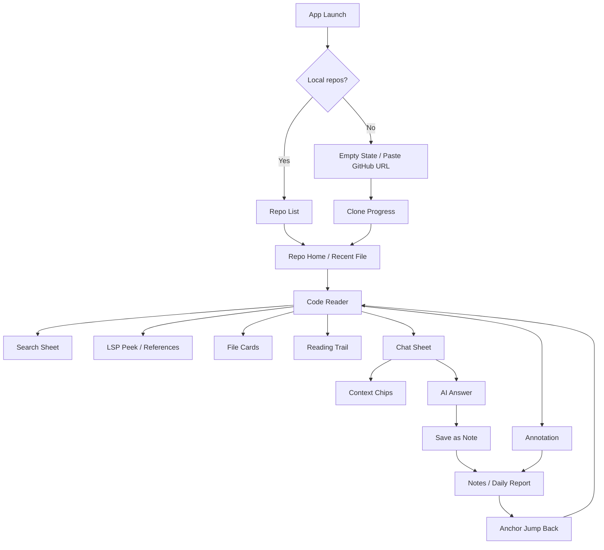
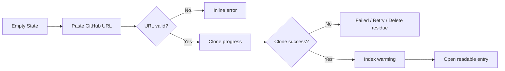
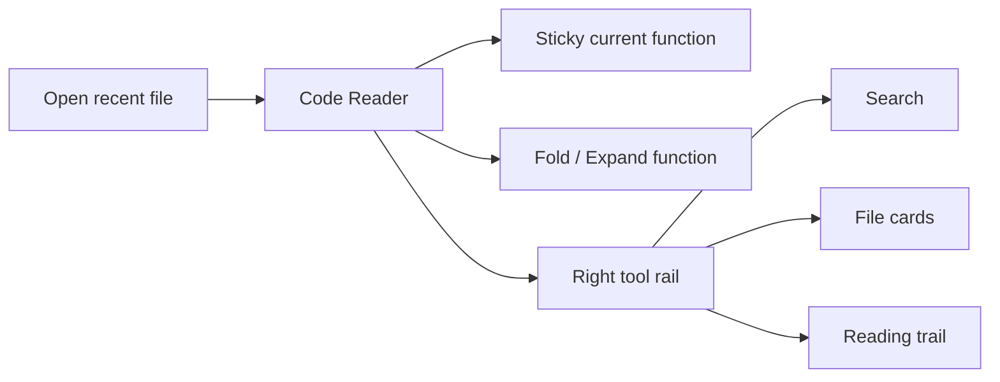
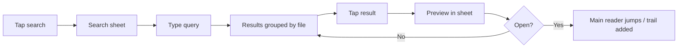
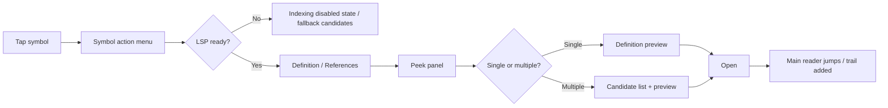
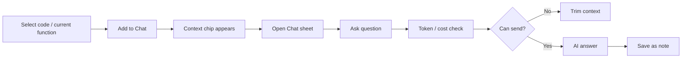
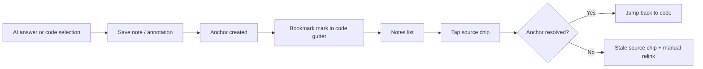

# Pocket Vibe Figma UX/UI 需求稿与低/中保真结构稿

版本：MVP Figma Brief v0.1  
日期：2026-05-13  
适用范围：Android 竖屏优先，横屏兼容；后续 HarmonyOS NEXT / 原生鸿蒙保留信息架构与核心交互复用空间。  
设计阶段：低/中保真结构稿，用于确认信息架构、页面关系、核心动线和交互状态，不进入最终视觉风格。

输入依据：

- `POCKET_VIBE_MVP_PRD.md`
- `POCKET_VIBE_MOBILE_UX_SPEC.md`
- `POCKET_VIBE_TECH_FEASIBILITY_ARCHITECTURE_REPORT.md`
- `POCKET_VIBE_COMPETITIVE_ANALYSIS.md`

## 1. 设计目标

Pocket Vibe 的 Figma 第一版不做营销页、不做完整高保真视觉系统，重点验证四件事：

1. 手机竖屏是否能稳定承载真实代码阅读。
2. 搜索、LSP 跳转、引用查找是否能“不打断阅读”。
3. Chat 浮层和上下文 chip 是否能自然服务源码理解。
4. 笔记、批注、日报是否能形成知识沉淀闭环。

设计产出应让产品、研发、设计三方能回答：

- 用户打开 App 后如何进入最近源码阅读位置？
- 代码阅读主界面默认显示哪些信息，隐藏哪些工具？
- 搜索、跳转定义、查找引用、阅读轨迹是否会打断当前阅读位置？
- Chat 半屏打开时，代码区如何避让？
- 从 AI 回答保存为笔记后，用户如何知道笔记已绑定到源码位置？
- LSP 未就绪、离线、anchor 失效时，界面如何降级？

## 2. Figma 文件建议结构

建议 Figma 文件命名：

`Pocket Vibe MVP UX UI Wireframes`

建议页面：

| Figma Page                | 内容                                    | 目的             |
| ------------------------- | --------------------------------------- | ---------------- |
| `00 Cover`                | 项目名、版本、设计范围、设备规格        | 对齐评审入口     |
| `01 IA & User Flows`      | 信息架构、核心路径、状态流              | 先确认产品骨架   |
| `02 Mobile Wireframes`    | 竖屏低/中保真页面                       | 确认核心界面     |
| `03 Landscape Wireframes` | 横屏关键状态                            | 确认横屏兼容     |
| `04 Components`           | 基础组件、代码组件、sheet、chip、状态点 | 供后续高保真复用 |
| `05 Prototype Links`      | 关键交互连线说明                        | 用于点击原型     |
| `06 Edge States`          | 空状态、失败、离线、索引中、anchor 失效 | 确认异常体验     |

设备画板：

| 设备               |        尺寸 | 用途                     |
| ------------------ | ----------: | ------------------------ |
| Android compact    | `360 x 800` | 小屏竖屏可用性底线       |
| Android baseline   | `390 x 844` | 主设计规格               |
| Android large      | `412 x 915` | 大屏竖屏适配             |
| Landscape baseline | `844 x 390` | 横屏代码 + Chat/结果面板 |

设计密度：

- 低保真用于页面关系和布局区域。
- 中保真用于代码阅读页、Chat sheet、LSP peek、搜索结果等关键交互。
- 暂不定义品牌插画、营销视觉、复杂动效细节。

## 3. 信息架构



主导航层级：

| 层级   | 页面/区域               | 说明                                                  |
| ------ | ----------------------- | ----------------------------------------------------- |
| L0     | Repo List / Empty State | App 入口，管理本地已 clone 仓库                       |
| L1     | Repo Reader             | 阅读主工作台，默认进入最近文件                        |
| L2     | Sheets / Peeks          | 搜索、LSP、Chat、批注、保存笔记均是浮层，不替换主阅读 |
| L3     | Notes / Daily Report    | 项目知识沉淀入口，可跳回源码                          |
| Global | Settings                | 模型配置、API key、本地存储、阅读偏好                 |

核心原则：

- 代码阅读页是 MVP 的中心，不要让笔记、Chat、搜索变成平级重页面。
- 大多数工具应以 bottom sheet、side sheet、peek 或 overlay 出现。
- 只有用户明确点击“打开”时，才改变主阅读卡片和回退栈。

## 4. 核心用户流

### 4.1 首次导入仓库



关键交互：

- URL 输入页应解释“仅支持公共 GitHub repo”，但不做长 onboarding。
- clone 进度显示阶段：校验、下载、写入、准备索引。
- clone 完成后立即进入阅读，而不是停在成功页。
- 索引状态作为弱提示，不能阻塞阅读。

### 4.2 阅读与结构理解



关键交互：

- 默认代码面积不低于 80%。
- 顶部路径栏滚动时可收缩，sticky 函数栏常驻。
- 折叠块必须展示函数名、行数、docstring 摘要。
- LSP 状态以小状态点表达，不抢注意力。

### 4.3 搜索与半屏预览



关键交互：

- 点击搜索结果不立即跳主阅读区。
- 预览态在 sheet 内完成。
- “打开”才改变主阅读卡片并写入轨迹。

### 4.4 LSP 跳转与引用查找



关键交互：

- 单一定义也先 peek，不直接跳。
- 多候选定义使用候选列表 + 预览双区结构。
- LSP 未就绪时必须避免假装准确结果。
- fallback 结果标注为“候选”，不标注为“定义”。

### 4.5 Chat 与上下文 chip



关键交互：

- Chat 默认 46% 高度，代码区底部 inset 自动避让。
- 当前选区若被遮挡，代码区自动滚动让选区可见。
- chip 可移除、可点击跳回源代码。
- token 超限时发送按钮禁用。

### 4.6 笔记、批注与跳回代码



关键交互：

- 保存为笔记不离开当前阅读上下文。
- 成功后用 snackbar + gutter bookmark 表达绑定成功。
- anchor 失效时，笔记仍可读，跳转入口进入失效态。

## 5. 页面清单与画板优先级

### 5.1 P0 必画画板

| ID   | 画板                    | 规格    | 保真度 | 目的                              |
| ---- | ----------------------- | ------- | ------ | --------------------------------- |
| F-01 | Repo Empty              | 390x844 | 中     | 首次用户粘贴 GitHub URL           |
| F-02 | Paste URL / Validation  | 390x844 | 中     | URL 输入、校验、错误              |
| F-03 | Clone Progress          | 390x844 | 中     | clone 进度、失败、重试            |
| F-04 | Repo List               | 390x844 | 中     | 已 clone 仓库、索引状态、最近打开 |
| F-05 | Reader Default          | 390x844 | 中     | 代码阅读主界面                    |
| F-06 | Reader Folded           | 390x844 | 中     | 函数折叠、摘要、sticky 函数       |
| F-07 | Right Tool Rail         | 390x844 | 中     | 搜索、卡片、轨迹入口              |
| F-08 | Search Sheet Results    | 390x844 | 中     | 搜索结果列表                      |
| F-09 | Search Preview          | 390x844 | 中     | 半屏预览，不跳主阅读              |
| F-10 | Symbol Action Menu      | 390x844 | 中     | 点击符号后的动作层                |
| F-11 | Definition Peek         | 390x844 | 中     | 单一定义预览                      |
| F-12 | References Panel        | 390x844 | 中     | 引用结果按文件分组                |
| F-13 | File Cards              | 390x844 | 中     | 最近文件卡片栈                    |
| F-14 | Reading Trail Drawer    | 390x844 | 中     | 右侧阅读轨迹                      |
| F-15 | Code Selection Toolbar  | 390x844 | 中     | 选区、加入 Chat、批注             |
| F-16 | Chat Half Sheet         | 390x844 | 中     | Chat + context chips              |
| F-17 | Chat Token Limit        | 390x844 | 中     | token 超限、裁剪                  |
| F-18 | Save Note Tray          | 390x844 | 中     | AI 回答保存为笔记                 |
| F-19 | Code Annotation         | 390x844 | 中     | 代码批注 mini sheet               |
| F-20 | Notes List              | 390x844 | 中     | 笔记、批注、日报入口              |
| F-21 | Note Detail with Source | 390x844 | 中     | 来源 chip 跳回代码                |
| F-22 | Daily Report            | 390x844 | 中     | 当天学习摘要                      |
| F-23 | Offline State           | 390x844 | 低     | 离线可读、Chat 不可发             |
| F-24 | LSP Indexing State      | 390x844 | 低     | LSP 未就绪降级                    |
| F-25 | Anchor Stale State      | 390x844 | 低     | anchor 失效                       |
| F-26 | Landscape Reader + Chat | 844x390 | 中     | 横屏双栏布局                      |

### 5.2 P1 可延后画板

| ID   | 画板                    | 说明                            |
| ---- | ----------------------- | ------------------------------- |
| F-27 | Settings / Model Config | API key、base URL、model        |
| F-28 | Reading Preferences     | 字号、换行、阅读密度            |
| F-29 | Account / Sync          | 登录、同步、API key 不同步      |
| F-30 | Knowledge Card Detail   | 知识卡片可作为 v0.2             |
| F-31 | Custom Skill Entry      | 自定义 prompt/skill 可作为 v0.2 |

## 6. 低/中保真线框结构

以下线框用于 Figma 结构稿，不代表最终视觉。

### 6.1 Repo Empty

目标：用户无本地仓库时，快速理解下一步是粘贴公共 GitHub URL。

```text
┌──────────────────────────────┐
│ Pocket Vibe                  │
│                         ⚙    │
├──────────────────────────────┤
│                              │
│        Read code anywhere     │
│        手机认真读源码         │
│                              │
│  ┌────────────────────────┐  │
│  │ Paste GitHub repo URL  │  │
│  └────────────────────────┘  │
│  Only public GitHub repos     │
│                              │
│  Recent read packs            │
│  React · Vue · FastAPI        │
│                              │
└──────────────────────────────┘
```

布局要求：

- 入口清晰，但不要做营销式 hero。
- “Only public GitHub repos”必须可见。
- 如果未来加入官方读码包，可在底部做轻量入口。

### 6.2 Clone Progress

```text
┌──────────────────────────────┐
│ Import repo              ✕   │
├──────────────────────────────┤
│ facebook/react                │
│ https://github.com/...        │
│                              │
│ Downloading objects           │
│ ███████████░░░░  68%          │
│ 3.4 MB/s · 42s left           │
│                              │
│ Stages                        │
│ ✓ Validate URL                │
│ ✓ Create local repo           │
│ ● Download source             │
│ ○ Prepare index               │
│                              │
│              Cancel           │
└──────────────────────────────┘
```

状态：

- cloning
- failed with retry
- storage insufficient
- public repo validation failed

### 6.3 Repo List

```text
┌──────────────────────────────┐
│ Pocket Vibe              +   │
├──────────────────────────────┤
│ Continue reading             │
│ ┌──────────────────────────┐ │
│ │ react                    │ │
│ │ src/react/src/... L128   │ │
│ │ LSP indexing · 2 notes   │ │
│ └──────────────────────────┘ │
│                              │
│ Local repos                  │
│ ┌──────────────────────────┐ │
│ │ fastapi       Ready      │ │
│ │ Last opened 10 min ago   │ │
│ └──────────────────────────┘ │
│ ┌──────────────────────────┐ │
│ │ gin          Search only │ │
│ │ LSP failed · Retry       │ │
│ └──────────────────────────┘ │
└──────────────────────────────┘
```

信息优先级：

- repo name
- last file / last position
- index status
- local size 可在二级操作中展示，不抢首屏。

### 6.4 Reader Default

```text
┌──────────────────────────────┐
│ react · src/runtime/core.ts ▣ │  32dp path bar
├──────────────────────────────┤
│ resolveModule() L128-L184 ●  │  36dp sticky function
├────┬─────────────────────────┤
│128 │ function resolveModule( │
│129 │   specifier, parent     │
│130 │ ) {                     │
│131 │   const cacheKey = ...  │
│132 │   if (cache.has(...))   │
│133 │     return cache.get... │
│... │                         │
│    │                         │
│    │                         │
│    │                    ◉    │  Chat FAB
└────┴─────────────────────────┘
```

固定区域：

- path bar：仓库短名、当前文件路径、文件卡片按钮。
- sticky function：当前函数、行范围、函数长度、索引状态点。
- code canvas：行号列固定，代码内容可横向滚动。
- Chat FAB：右下，滚动时降低透明度。

### 6.5 Reader Folded

```text
┌──────────────────────────────┐
│ react · src/runtime/core.ts ▣ │
├──────────────────────────────┤
│ ModuleGraph L40-L260 ●       │
├────┬─────────────────────────┤
│ 42 │ ▸ parseImports()        │
│    │   38 lines · reads AST  │
│ 88 │ ▸ resolveModule()       │
│    │   57 lines · resolve... │
│145 │ ▾ loadModule()          │
│146 │   async function ...    │
│147 │   ...                   │
│    │                    ◉    │
└────┴─────────────────────────┘
```

折叠块内容：

- expand/collapse icon
- function/method name
- signature 简写
- lines count
- docstring/comment 第一行

### 6.6 Right Tool Rail

```text
┌──────────────────────────────┐
│ react · src/runtime/core.ts ▣ │
├──────────────────────────────┤
│ resolveModule() L128-L184 ●  │
├────┬─────────────────────┬───┤
│... │ code                │ 🔍│
│... │ code                │ ▣ │
│... │ code                │ ↩ │
│... │ code                │   │
│    │                 ◉   │   │
└────┴─────────────────────┴───┘
```

触发：

- 轻点右边缘中部 24dp 热区。
- 停顿后自动收起。
- 三个按钮分别为 search、file cards、reading trail。

### 6.7 Search Sheet Results

```text
┌──────────────────────────────┐
│ Reader dimmed 8%             │
│ ...                          │
├──────────────────────────────┤
│ Search in react              │  bottom sheet 54%
│ ┌──────────────────────────┐ │
│ │ resolveModule            │ │
│ └──────────────────────────┘ │
│ src/runtime/core.ts          │
│ 128 function resolveModule   │
│ 172 cache.resolveModule(...) │
│                              │
│ src/server/loader.ts         │
│ 44  await resolveModule(...) │
└──────────────────────────────┘
```

### 6.8 Search Preview

```text
┌──────────────────────────────┐
│ Reader remains unchanged     │
├──────────────────────────────┤
│ Preview src/runtime/core.ts  │
│ L128 · resolveModule         │
│ ┌──────────────────────────┐ │
│ │ 126 const cache = ...    │ │
│ │ 127                     │ │
│ │ 128 function resolve...  │ │
│ │ 129   const key = ...    │ │
│ └──────────────────────────┘ │
│        Add context   Open    │
└──────────────────────────────┘
```

规则：

- Open 前不写入阅读轨迹。
- Add context 可直接生成 Chat chip。

### 6.9 Symbol Action Menu

```text
┌──────────────────────────────┐
│ resolveModule() L128-L184 ●  │
├────┬─────────────────────────┤
│132 │ const result = resolver │
│    │              ▲          │
│    │ ┌────────────────────┐  │
│    │ │ Go to definition   │  │
│    │ │ Find references    │  │
│    │ │ Add to Chat        │  │
│    │ │ Ask AI             │  │
│    │ └────────────────────┘  │
└────┴─────────────────────────┘
```

状态：

- LSP ready：定义/引用可用。
- LSP indexing：定义/引用置灰，展示索引中。
- fallback candidates：展示“候选跳转”入口。

### 6.10 Definition Peek

```text
┌──────────────────────────────┐
│ Reader source highlighted    │
├──────────────────────────────┤
│ Definition                   │  bottom peek 52%
│ src/resolver/index.ts · L38  │
│ ┌──────────────────────────┐ │
│ │ 36 export class Resolver │ │
│ │ 37                      │ │
│ │ 38 resolveModule(...) {  │ │
│ │ 39   ...                 │ │
│ └──────────────────────────┘ │
│     Ask AI   Add context Open│
└──────────────────────────────┘
```

### 6.11 References Panel

```text
┌──────────────────────────────┐
│ References: resolveModule    │
│ 12 refs in 5 files       ⌄   │
├──────────────────────────────┤
│ src/runtime/core.ts       4  │
│ 128 function resolveModule   │
│ 172 cache.resolveModule      │
│                              │
│ src/server/loader.ts      3  │
│ 44 await resolveModule       │
│ 92 return resolveModule      │
│                              │
│        Filter      Open all? │
└──────────────────────────────┘
```

### 6.12 File Cards

```text
┌──────────────────────────────┐
│                              │
│     ┌────────────────────┐   │
│   ┌─│ src/runtime/core.ts │─┐ │
│   │ │ resolveModule L132 │ │ │
│   │ │ code preview...    │ │ │
│   │ └────────────────────┘ │ │
│   │  src/server/loader.ts  │ │
│   └────────────────────────┘ │
│                              │
│ Swipe left/right · up to open│
└──────────────────────────────┘
```

### 6.13 Reading Trail Drawer

```text
┌──────────────┬───────────────┐
│ code reader  │ Trail         │
│              │ now           │
│              │ core.ts L132  │
│              │ from search   │
│              │               │
│              │ 2 min         │
│              │ loader.ts L44 │
│              │ def jump      │
│              │               │
└──────────────┴───────────────┘
```

### 6.14 Chat Half Sheet

```text
┌──────────────────────────────┐
│ code viewport shrunk         │
│ selected lines visible       │
├──────────────────────────────┤
│ ─                            │
│ Chips: resolveModule L128    │
│ [Explain] [Next file] [Calls]│
│                              │
│ AI message area              │
│                              │
│ ┌──────────────────────────┐ │
│ │ Ask about this code...   │ │
│ └──────────────────────────┘ │
│ ~1.2k tok · $0.01      Send │
└──────────────────────────────┘
```

### 6.15 Save Note Tray

```text
┌──────────────────────────────┐
│ Chat remains behind          │
├──────────────────────────────┤
│ Save as note                 │
│ Title                        │
│ ┌──────────────────────────┐ │
│ │ resolveModule explained  │ │
│ └──────────────────────────┘ │
│ Source                       │
│ [core.ts · resolveModule]    │
│ Preview                      │
│ This function resolves...    │
│                              │
│        Later       Save      │
└──────────────────────────────┘
```

### 6.16 Notes List

```text
┌──────────────────────────────┐
│ react · Notes                │
├──────────────────────────────┤
│ Today                        │
│ ┌──────────────────────────┐ │
│ │ Daily report             │ │
│ │ 6 files · 3 questions    │ │
│ └──────────────────────────┘ │
│ ┌──────────────────────────┐ │
│ │ resolveModule explained  │ │
│ │ core.ts · L128-L184      │ │
│ └──────────────────────────┘ │
│ ┌──────────────────────────┐ │
│ │ Annotation               │ │
│ │ loader.ts · L44          │ │
│ └──────────────────────────┘ │
└──────────────────────────────┘
```

## 7. 组件清单

### 7.1 App Shell

| 组件                | 说明                             | 关键状态                  |
| ------------------- | -------------------------------- | ------------------------- |
| Top Path Bar        | 仓库名 + 文件路径 + 卡片入口     | expanded / collapsed      |
| Sticky Function Bar | 当前函数、行范围、长度、索引状态 | ready / indexing / failed |
| Right Tool Rail     | 搜索、卡片、轨迹                 | collapsed / expanded      |
| Bottom Sheet        | 搜索、Chat、保存、批注通用容器   | half / expanded / full    |
| Side Drawer         | 阅读轨迹横向入口                 | open / closed             |

### 7.2 Code Reader Components

| 组件              | 说明              | 关键状态                                 |
| ----------------- | ----------------- | ---------------------------------------- |
| Code Line         | 行号 + 高亮文本   | normal / selected / search hit / current |
| Fold Block        | 折叠函数摘要      | collapsed / expanded                     |
| Symbol Highlight  | 点击符号高亮      | hover/tap / active                       |
| Gutter Bookmark   | 笔记/批注关联标记 | note / annotation / stale                |
| Selection Toolbar | 选区操作条        | join chat / annotate / copy              |

### 7.3 Semantic Navigation

| 组件                 | 说明           | 关键状态                    |
| -------------------- | -------------- | --------------------------- |
| Symbol Menu          | 符号动作菜单   | ready / indexing / fallback |
| Definition Peek      | 定义预览       | single / multi-candidate    |
| Candidate Row        | 候选定义       | selected / unselected       |
| References Group     | 引用按文件分组 | collapsed / expanded        |
| Preview Code Snippet | 预览代码片段   | loading / ready / failed    |

### 7.4 Chat & Knowledge

| 组件                | 说明                   | 关键状态                        |
| ------------------- | ---------------------- | ------------------------------- |
| Chat FAB            | 唤醒 Chat              | idle / dimmed / active          |
| Context Chip        | 文件、函数、选区上下文 | normal / over-limit / stale     |
| Quick Prompt Button | 快捷提问               | enabled / disabled              |
| Token Cost Bar      | token 和费用估算       | ok / warning / blocked          |
| AI Message          | AI 回复                | streaming / complete / failed   |
| Save Note Tray      | 保存笔记               | draft / saving / saved / failed |
| Source Chip         | 笔记来源               | resolved / remapped / stale     |

## 8. 关键交互状态表

| 场景         | 默认行为                        | 不可接受行为             |
| ------------ | ------------------------------- | ------------------------ |
| 点击搜索结果 | 先在 sheet 内预览               | 直接替换主阅读区         |
| 点击符号定义 | 先显示 definition peek          | 立即跳走导致用户迷路     |
| LSP 未就绪   | 置灰或显示候选结果              | 展示假准确结果           |
| Chat 打开    | 代码区 inset 避让，选区保持可见 | Chat 直接遮住当前代码    |
| 保存笔记     | tray 内保存，阅读位置不变       | 跳到完整编辑页打断阅读   |
| anchor 失效  | 来源 chip 失效态，可手动重关联  | 静默跳到错误位置         |
| 横竖屏切换   | 保留文件、滚动、Chat、peek 状态 | 重新打开文件或丢失上下文 |

## 9. 视觉与布局约束

低/中保真阶段建议：

- 使用灰阶 + 单一强调色即可，不进入品牌色最终决策。
- 代码区域使用等宽字体占位，例如 `Roboto Mono` 或 `JetBrains Mono`。
- 保持代码阅读密度，不做大面积装饰。
- 卡片圆角不超过 8dp。
- 所有触控目标不小于 48dp。
- 右下 Chat FAB 不遮挡当前选区；滚动时可降低透明度。
- bottom sheet 默认高度：
  - Search：54%
  - Definition peek：52%
  - Chat：46%
  - Save note tray：42%
  - Annotation mini sheet：32%
- 横屏布局：
  - 代码区 58%
  - Chat/Search/LSP 面板 42%

## 10. 原型连线建议

Figma prototype 建议优先连以下路径：

1. Empty State -> Paste URL -> Clone Progress -> Reader Default。
2. Reader Default -> Right Tool Rail -> Search Sheet -> Search Preview -> Open -> Reader target。
3. Reader Default -> Symbol Menu -> Definition Peek -> Open -> Reader target -> Trail back。
4. Reader Default -> References Panel -> Reference Preview -> Add context -> Chat Sheet。
5. Reader Default -> Code Selection -> Add to Chat -> Chat Half Sheet -> Save Note Tray -> Snackbar + Bookmark。
6. Notes List -> Note Detail -> Source Chip -> Reader target。
7. Reader Default -> Chat Half Sheet -> Token Limit -> Trim Context。
8. Reader Default -> File Cards -> Select Card -> Reader restored.

Prototype interaction style:

- bottom sheet: smart animate / slide from bottom, 220-240ms。
- side drawer: slide from right, 200ms。
- file cards: scale current reader to 86%, smart animate。
- no heavy decorative animation in low/mid fidelity.

## 11. 评审问题清单

设计评审时优先确认这些问题：

1. 默认阅读页是否足够干净，代码面积是否过小？
2. 搜索、LSP、Chat 都使用 sheet/peek 后，浮层之间是否会冲突？
3. 单一定义也先 peek 是否符合用户预期，还是需要可配置“直接跳转”？
4. 右边缘工具轨是否容易被发现，是否需要顶部显性入口兜底？
5. Chat 默认 46% 高度是否足够，键盘弹出时是否还能看到代码？
6. 笔记保存是否太轻，用户是否需要进入完整编辑器确认？
7. bookmark 标记是否会干扰代码阅读？
8. LSP 未就绪时的候选跳转是否会让用户误解准确性？
9. 横屏双栏是否应该以 Chat 为主，还是 LSP/搜索共用右侧面板？
10. 后续 HarmonyOS NEXT 原生版重写壳层时，哪些组件必须保持交互一致？

## 12. 交付定义

本阶段完成后，应具备：

- Figma 页面结构和画板清单。
- P0 核心画板低/中保真稿。
- 核心用户流原型连线。
- 组件与状态命名规则。
- 浮层优先级规则。
- 异常状态与降级体验。

本阶段不包含：

- 最终品牌视觉。
- 图标最终设计。
- 完整 design token。
- 深色/浅色完整主题。
- 动效细节规格。
- 上架截图或营销物料。
