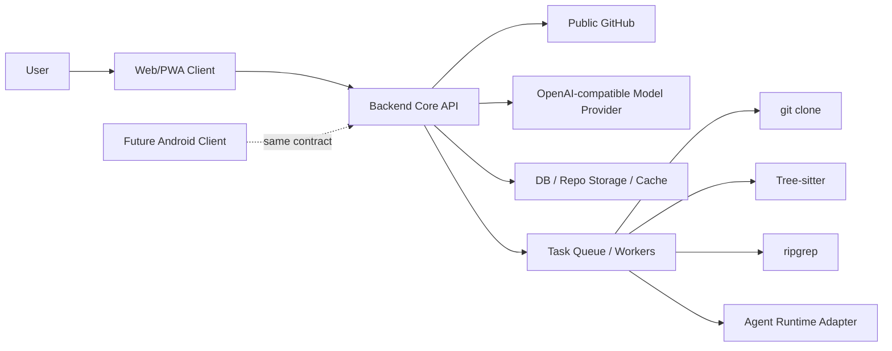
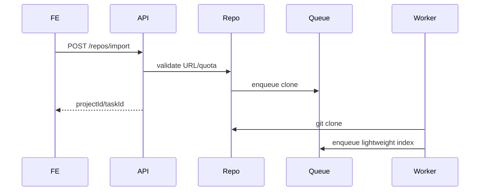
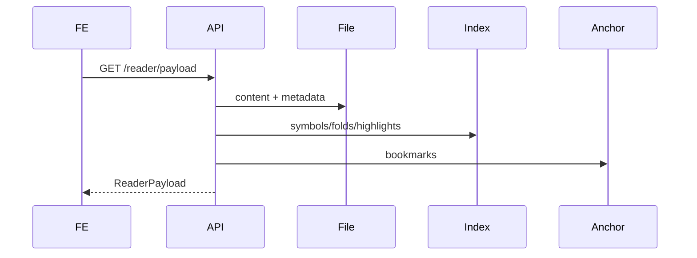
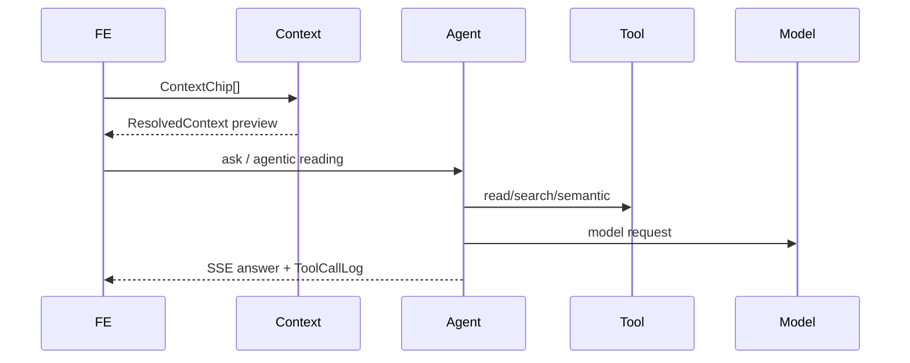
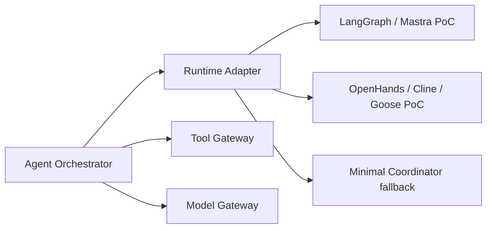

# Pocket Vibe v3 架构蓝图

版本：Architecture Blueprint v0.1  
日期：2026-05-17  
角色视角：系统架构师  
阶段：正式开发前架构收敛

## 1. 架构目标

Pocket Vibe v3 第一阶段采用 Web/PWA + Backend Core Service。架构目标是先跑通产品闭环，同时避免后续 Android / HarmonyOS 原生化时重写业务协议。

核心链路：

```text
Public GitHub repo
  -> Backend isolated workspace
  -> ReaderPayload
  -> Search / Semantic-lite / Anchor
  -> Context Resolver
  -> Agent Orchestrator
  -> Note / DailyReport
```

## 2. 系统上下文



实现默认：

- Web/PWA Client：TypeScript。
- Backend Core API：Go-first。
- API contract：OpenAPI / JSON Schema。
- Chat / Agent event：SSE。
- Android / HarmonyOS：后续复用同一 contract，不复用 Web 或 Go 的内部实现细节。

## 3. 前后端边界

| 领域 | 前端权威 | 后端权威 |
|---|---|---|
| UI 布局 | Reader / Chat / Sheet / Context chips 呈现 | 不参与 |
| 当前选择 | 临时 selection UI | 转成 `SourceRange` 后可持久化 |
| 文件内容 | 展示 | 文件读取、过滤、metadata |
| ReaderPayload | 消费 | 生成 |
| Context Basket | 展示、编辑、发送前确认 | resolve、estimate、trim |
| Agent | 展示 plan/tool/result | run lifecycle、ToolCallLog、tools |
| Note | 编辑草稿 | 保存、anchor、查询 |
| Anchor | 展示状态 | create / resolve / candidates |

## 4. Shared Schema / DTO 清单

必须平台无关：

- `Workspace`
- `Project`
- `Task`
- `FileNode`
- `SourceRange`
- `Anchor`
- `ReaderPayload`
- `HighlightChunk`
- `FoldRange`
- `SymbolRef`
- `SearchResult`
- `SemanticCandidate`
- `ContextChip`
- `ResolvedContext`
- `ChatSession`
- `AgentRun`
- `ToolCallLog`
- `Note`
- `DailyReport`
- `CapabilityStatus`
- `ApiError`

权威归属：

| 模型 | 权威 |
|---|---|
| `ReaderPayload` | 后端生成，前端/Android 消费 |
| `ContextChip` | 前端创建和展示，后端解析 |
| `Anchor` | 后端创建/解析，前端展示 |
| `ToolCallLog` | 后端权威，前端订阅 |
| `ChatSession` | 后端持久化，前端渲染 |
| `SourceRange` | shared schema |

## 5. API Contract 草案

首批 API：

```text
GET  /health
POST /workspaces
POST /repos/import
GET  /repos/:projectId/status
GET  /files/tree?projectId=
GET  /files/content?projectId=&filePath=
GET  /reader/payload?projectId=&filePath=
GET  /search?projectId=&query=
POST /semantic/definition
POST /semantic/references
POST /context/resolve
POST /chat/sessions
POST /chat/sessions/:sessionId/messages
GET  /agent-runs/:runId/events
POST /notes
POST /anchors/resolve
```

协议建议：

- REST + JSON 作为默认。
- Chat / Agent events 用 SSE。
- 所有响应带 `traceId`。
- 错误统一 `ApiError`。

## 6. 核心流程

### 6.1 Repo Import



### 6.2 ReaderPayload



### 6.3 Context -> Agent



## 7. 后端任务队列

任务类型：

- `clone`
- `index`
- `cleanup`
- `anchorResolve`
- `agentRun`
- `dailyReport`

状态：

- `queued`
- `running`
- `succeeded`
- `failed`
- `cancelled`
- `expired`

设计原则：

- Worker 复用 service interface。
- task 可取消、可重试、可清理。
- clone / index / agent 不阻塞主请求。

## 8. Agent Runtime Adapter

Agent 不直接绑死某个框架。



Adapter 必须支持：

- tool registry。
- permission level。
- streaming。
- cancel / retry。
- ToolCallLog。
- session resume。

## 9. 数据库和存储边界

| 数据 | 存储 |
|---|---|
| workspace/project/task | relational DB |
| notes/chat/tool logs/anchors | relational DB |
| repo files | filesystem or object storage |
| index cache | filesystem / DB hybrid |
| temporary snippets | TTL cache |

禁止：

- API key 明文入库。
- CodeMirror state 入库。
- DOM offset / scroll pixel 入库。
- repo 外路径读取。

## 10. 安全边界

必须实现：

- workspace isolation。
- repo storage sandbox。
- path traversal 防护。
- repo size limit。
- clone timeout。
- task cleanup。
- secret redaction。
- Tool permission。
- unrestricted network 禁止。

## 11. Android / HarmonyOS 复用边界

原生端复用：

- shared schema。
- Backend Core API。
- ReaderPayload。
- Anchor / ContextChip / ToolCallLog。
- Agent protocol。
- Note / ChatSession。

原生端替换：

- UI shell。
- Reader renderer。
- storage adapter。
- secure key storage。
- background task adapter。
- 后续 local `pocket-core`。

## 12. 技术演进路线

1. Mock skeleton。
2. Real repo import。
3. Reader payload。
4. Search / preview。
5. Tree-sitter symbols / folds。
6. Semantic-lite。
7. Anchor create / resolve。
8. Context resolver。
9. Agent runtime PoC。
10. Notes / daily report。
11. Android contract readiness。

## 13. Spike 清单

| Spike | 目标 |
|---|---|
| CodeMirror ReaderPayload | 验证 payload 可驱动 Web reader |
| Git clone sandbox | 验证隔离、超时、清理 |
| ripgrep search | 验证搜索延迟和过滤规则 |
| Tree-sitter parse | 验证 JS/TS/Python/Go/Java 基础结构 |
| Context Resolver | 验证 `#codebase` retrieve intent |
| Agent PoC | 比较 2-3 个 Agent runtime |
| SSE streaming | 验证 Chat / Agent events |
| Kotlin model generation | 验证 shared schema 可供 Android 使用 |

## 14. 架构风险

| 风险 | 缓解 |
|---|---|
| shared schema 被 UI 污染 | schema review gate |
| Agent runtime 框架锁定 | adapter interface + PoC |
| LSP 过早拖慢 | semantic-lite first |
| repo storage 成本 | quota + TTL + cleanup |
| 国内网络不稳定 | proxy / retry / readable errors |
| Android 返工 | ReaderPayload 和 Anchor 平台无关 |
