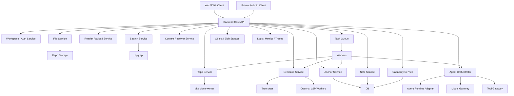
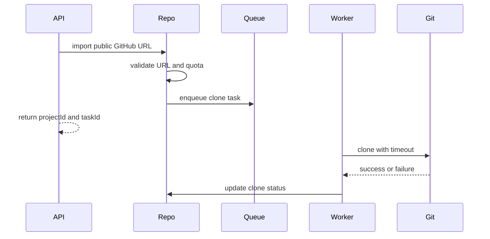
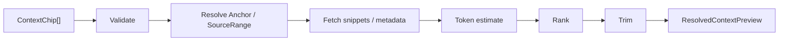
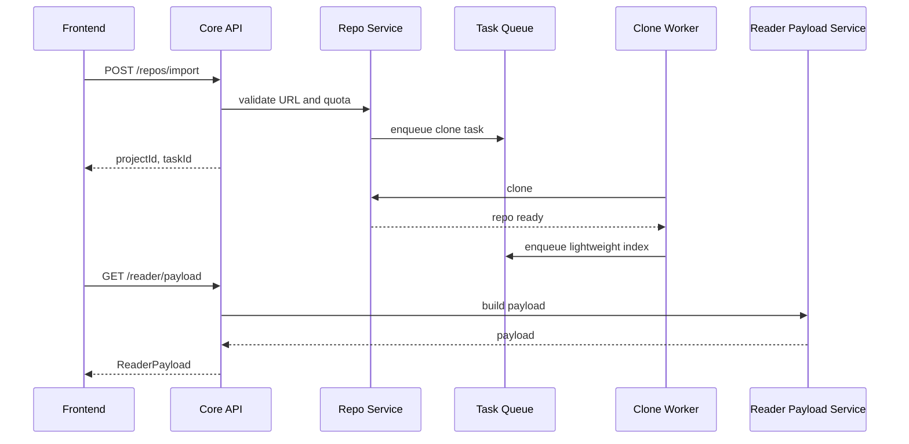
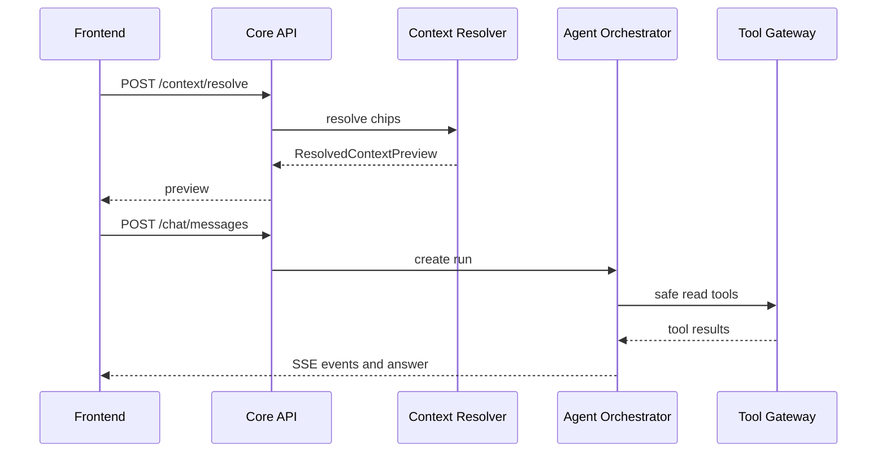

# Pocket Vibe Web/PWA 后端模块设计

版本：Backend Design v0.1  
日期：2026-05-16  
阶段：工程启动前后端设计  
适用范围：Pocket Vibe Web/PWA MVP 后端；后续 Android / HarmonyOS 原生端复用同一 API contract、schema、Agent 协议和核心能力边界。

## 1. 设计目标

本文档专门定义 Web/PWA MVP 后端模块。它承接：

- `POCKET_VIBE_MVP_PRD.md`
- `POCKET_VIBE_WEB_PWA_HIGH_LEVEL_AND_MODULE_DESIGN.md`
- `POCKET_VIBE_WEB_PWA_FRONTEND_MODULE_DESIGN.md`

后端要支撑的核心闭环：

```text
Public GitHub URL
  -> isolated workspace
  -> file tree / reader payload
  -> search / symbol / definition / references
  -> Context Basket resolve
  -> Ask / Agentic Reading
  -> Save Note / Anchor / Daily Report
```

本阶段不写业务代码，但要把后端边界、模块职责、API 分组、数据持久化、异步任务、Agent 复用策略和安全约束设计清楚。

## 2. 后端设计原则

### 2.1 Core owns code intelligence

仓库导入、文件树、索引、搜索、语义候选、Anchor 解析、Context Basket 解析和 Agent 工具调用都属于后端 core service。前端只消费结构化 DTO，不直接接触 git、Tree-sitter、ripgrep、LSP runtime 或模型 provider。

### 2.2 API contract first

Web/PWA、后续 Android、后续 HarmonyOS 都应复用同一套 API contract 和 schema。后端 API 不允许暴露 CodeMirror、DOM、浏览器 URL hash、移动端 View 坐标等 UI 私有状态。

### 2.3 Async by default

clone、index、search warmup、semantic indexing、anchor re-resolve、Agent 多步任务、daily report 生成都应按任务处理。短请求返回状态，长任务通过 polling、SSE 或 event stream 通知前端。

### 2.4 Honest degradation

LSP 未就绪、索引中、搜索超时、repo 太大、Anchor stale、模型不可用、token 超限，都必须以结构化 capability / error 返回。不能把 fallback 搜索包装成精准语义。

### 2.5 Ecosystem first for Agent

Agent runtime 不闭门造车。后端要先设计 `Agent Runtime Adapter`，通过 PoC 评估 LangGraph、Mastra、OpenHands、Cline、Goose、Aider、Continue、AutoGen、opencode 等方案后再决定集成方式。

### 2.6 China-friendly infrastructure

后端部署和依赖要考虑中国大陆网络与模型生态：

- 不依赖 Google Cloud / Firebase / GMS 类服务作为核心链路。
- 模型网关优先支持 OpenAI-compatible base URL 和国内模型服务。
- GitHub clone 可能受网络影响，后端需支持代理、重试、超时和清理策略。
- 日志、统计、崩溃上报、对象存储和消息队列都应可自建或替换。

## 3. 后端总体架构



## 4. 建议后端目录结构

这是模块边界建议，不代表现在要立即创建代码。

```text
services/api/src/
  app/
    server/
    routes/
    middleware/
    config/
  modules/
    workspace/
    repo/
    file/
    reader-payload/
    index/
    search/
    semantic/
    anchor/
    context-resolver/
    agent/
    model-gateway/
    note/
    daily-report/
    capability/
    task/
    observability/
    security/
  shared/
    schema/
    errors/
    result/
    storage/
    queue/
    time/
    id/
```

设计约束：

- `shared/schema` 与前端共享语义，但不依赖前端框架。
- `modules/*` 只能通过明确 service interface 调用，避免隐式跨模块读写数据库。
- Worker 和 HTTP route 复用同一 service，不复制业务逻辑。
- Agent 运行时集成放在 `agent/runtime-adapters/*`，避免框架私有状态污染核心模型。

## 5. API 分组

| API group | 说明 | MVP |
|---|---|---|
| `/workspaces` | 匿名 workspace、配额、TTL、状态 | P0 |
| `/repos` | import、clone task、repo list、delete | P0 |
| `/files` | file tree、file content、metadata | P0 |
| `/reader` | reader payload、folds、symbols、bookmarks | P0 |
| `/search` | full-text search、search preview | P0 |
| `/semantic` | definition、references、symbol candidates | P0/P1 |
| `/anchors` | create、resolve、candidate relink | P0 |
| `/context` | resolve context chips、estimate token、trim preview | P0 |
| `/chat` | session、message、streaming response、cancel | P0 |
| `/agent-runs` | Agentic Reading run、ToolCallLog stream | P0/P1 |
| `/notes` | create、update、list、delete、source jump | P0 |
| `/daily-reports` | local/statistical daily report draft | P0/P1 |
| `/capabilities` | repo / index / semantic / model capability status | P0 |
| `/settings` | model profile、provider config | P0/P1 |

## 6. 模块设计

### 6.1 Backend Core API

职责：

- HTTP route / SSE endpoint。
- request validation。
- auth / workspace resolution。
- rate limit / quota。
- error mapping。
- trace id / request id 注入。
- 返回平台无关 DTO。

不负责：

- 直接执行 git / Tree-sitter / model call。
- 拼装 UI 状态。
- 暴露 worker 内部实现。

建议协议：

- 普通资源：REST + JSON。
- Chat streaming：SSE 优先，后续可 WebSocket。
- Agent run events：SSE event stream。
- 文件内容：JSON 包装文本和 metadata；大文件后续支持 range / chunk。

### 6.2 Workspace Service

职责：

- 创建匿名 workspace。
- 维护 workspace 配额、TTL、repo 数量限制。
- 隔离 repo storage、notes、chat sessions、tasks。
- 后续账号系统接入前，支撑匿名体验。

核心字段：

- `workspaceId`
- `createdAt`
- `lastActiveAt`
- `expiresAt`
- `quota`
- `status`

MVP 策略：

- 匿名 workspace。
- cookie / local token 绑定。
- 支持清理过期 workspace。

### 6.3 Repo Service

职责：

- 公共 GitHub URL 校验。
- clone task 创建。
- clone / cleanup。
- repo metadata。
- repo delete。

流程：



边界：

- P0 不支持私有仓库。
- P0 不做 GitHub 登录。
- P0 不支持本地目录导入。
- submodule / LFS 只做提示和降级。

国内网络策略：

- clone worker 支持 configurable proxy。
- clone timeout 必须可配置。
- 失败原因需要可读：DNS、timeout、auth denied、repo too large、disk quota。
- clone 残留必须可清理。

### 6.4 File Service

职责：

- filtered file tree。
- open file。
- file metadata。
- encoding detection。
- binary / large file guard。

过滤建议：

- `.git`
- `node_modules`
- `vendor`
- `dist`
- `build`
- `.next`
- `target`
- binary files
- generated lock/cache artifacts 可降级展示

返回：

- file path。
- size。
- language guess。
- content hash。
- line count。
- readable / skipped reason。

### 6.5 Reader Payload Service

职责：

- 聚合文件内容、highlight chunks、fold ranges、symbol refs、note anchors、capability status。
- 为 Web CodeMirror 和未来 Android native reader 提供同一 payload。

输入：

- projectId。
- filePath。
- optional anchor / range。

输出：

```ts
type ReaderPayload = {
  projectId: string;
  filePath: string;
  content: string;
  language?: string;
  lineCount: number;
  contentHash: string;
  highlights: HighlightChunk[];
  folds: FoldRange[];
  symbols: SymbolRef[];
  anchors: Anchor[];
  capability: Record<string, CapabilityStatus>;
};
```

注意：

- `HighlightChunk`、`FoldRange`、`SymbolRef` 需要进入正式 schema review。
- Reader payload 不包含 CodeMirror state。

### 6.6 Index Service

职责：

- Tree-sitter parse。
- symbol outline。
- fold ranges。
- highlight chunks。
- index status。
- incremental re-index 后续预留。

语言优先级：

- P0：JS/TS、Python、Go、Java semantic-lite。
- P1：Kotlin、ArkTS/ETS、C/C++。

任务策略：

- clone 成功后启动 lightweight index。
- Reader 打开文件时可按需 parse。
- 大仓库按文件优先级渐进索引。
- index failed 不阻塞 file open。

### 6.7 Search Service

职责：

- 全文搜索。
- 搜索结果片段。
- 搜索 preview。
- 搜索结果转 ContextChip。

技术路线：

- P0 后端调用 ripgrep 或等效实现。
- 过滤 ignore 规则和大文件。
- 结果分页或限制 top N。

返回：

- `SearchResult[]`
- total estimate。
- truncated flag。
- skipped reason。

约束：

- 搜索不能阻塞 Reader。
- query 必须有超时。
- binary / generated / dependency path 默认跳过。

### 6.8 Semantic Service

职责：

- definition candidates。
- references candidates。
- symbol candidates。
- fallback reason。
- confidence score。

MVP 路线：

1. semantic-lite：Tree-sitter symbol graph + import resolver + search ranking。
2. JS/TS 优先评估 TypeScript language service。
3. Python / Go 后续评估 Pyright / gopls。
4. Java P0 默认 semantic-lite，不承诺 JDT LS。

返回必须包含：

- source：`lsp` / `semanticLite` / `searchFallback`。
- confidence。
- reason。
- snippet。
- range。

禁止：

- 把 `searchFallback` 包装成精准 definition。
- 低置信结果自动跳转。

### 6.9 Anchor Service

职责：

- create anchor。
- resolve anchor。
- stale detection。
- candidate relink。
- confidence scoring。

Anchor 组成：

- projectId。
- filePath。
- SourceRange。
- symbolName。
- commitHash。
- contentHash / snippetHash。
- context fingerprint。

解析策略：

1. exact file + commit + range。
2. same file + snippet hash。
3. same file + symbol name。
4. repo-wide symbol candidate。
5. fallback candidates with confidence。

MVP 原则：

- stale 时返回候选，不自动跳。
- note 永远可以打开。
- anchor resolver 不依赖 UI 坐标。

### 6.10 Context Resolver Service

Context Resolver 是前端 Context Basket 的后端 counterpart。它负责把前端 chip 解析成可发送给 Agent 的真实上下文。

职责：

- resolve `ContextChip[]`。
- token estimate。
- rank / trim。
- stale / missing / oversized 状态。
- 生成 send preview。
- 输出 Agent 可消费的 structured context。

流程：



输入示例：

- selection chip。
- current file chip。
- definition chip。
- references chip。
- search result chip。
- note chip。
- codebase query intent。

`#codebase` 策略：

- 不把整仓库塞进 prompt。
- 转为 `codebaseQuery` intent。
- 先 search / semantic retrieve。
- 再将 top candidates 作为 suggested chips。

### 6.11 Agent Orchestrator

职责：

- Chat session lifecycle。
- Agent run lifecycle。
- tool permission。
- ToolCallLog。
- Agent runtime adapter。
- prompt / context assembly。
- streaming events。
- cancel / retry / resume。

Agent 能力分级：

| 权限档 | 策略 |
|---|---|
| Safe read | 可自动执行，必须记录 ToolCallLog |
| Analysis / planning | 可自动执行，输出需带引用或依据 |
| App write | 需要用户确认或显式动作 |
| User-export write | 用户明确触发后写入草稿 / 导出 |
| Source write | MVP 禁止 |
| Dangerous / system | MVP 禁止 |

Agent runtime 策略：

- 先做 product benchmark 和 ecosystem PoC。
- 后端只定义 adapter interface。
- 候选框架不得污染核心 schema。
- 若短期自研，只允许自研最小 coordinator，不重造通用 agent framework。

Agent 事件：

- `run.started`
- `plan.created`
- `tool.started`
- `tool.completed`
- `tool.failed`
- `message.delta`
- `run.waitingForConfirmation`
- `run.completed`
- `run.cancelled`

### 6.12 Tool Gateway

职责：

- 暴露 Agent 可用工具。
- 校验工具权限。
- 执行工具。
- 记录 ToolCallLog。

MVP 工具：

| 工具 | 权限 | 说明 |
|---|---|---|
| `readFile` | Safe read | 读取文件片段 |
| `readSelection` | Safe read | 读取当前选区 |
| `search` | Safe read | 全文搜索 |
| `getSymbol` | Safe read | 获取 symbol 信息 |
| `definition` | Safe read | 查定义候选 |
| `references` | Safe read | 查引用候选 |
| `resolveAnchor` | Safe read | 解析 Anchor |
| `createNoteDraft` | App write | 创建笔记草稿 |
| `createAnnotationDraft` | App write | 创建批注草稿 |
| `createDailyReportDraft` | App write | 创建日报草稿 |

禁止工具：

- shell。
- install。
- source edit。
- git commit / push / PR。
- unrestricted network。

### 6.13 Model Gateway

职责：

- OpenAI-compatible provider。
- model profile。
- API key policy。
- streaming。
- retry / timeout。
- usage / token estimate。
- provider error normalization。

国内适配：

- 支持用户配置 base URL。
- 支持国内模型服务。
- 不假设 OpenAI 官方 endpoint 总是可用。
- provider SDK 不能深度绑死，优先 HTTP compatible adapter。

API key 策略待定：

- 用户自带 key。
- 服务端托管测试 key。
- 两者混合。

安全要求：

- API key 不写日志。
- error log 脱敏。
- chat / note 同步前做隐私说明。

### 6.14 Note Service

职责：

- Markdown note CRUD。
- save AI response as note。
- annotation draft。
- source anchors。
- note source jump。
- note list by project。

Note 不做：

- 写回源码仓库。
- 修改用户代码。
- 复杂知识卡片系统。

### 6.15 Daily Report Service

职责：

- 根据本地行为生成统计型日报。
- 文件阅读列表。
- 停留时间。
- 搜索 / 跳转 / 提问次数。
- 保存笔记和批注数量。
- 生成 Markdown draft。

MVP 原则：

- 日报不依赖大模型也能生成。
- AI 可帮助润色，但不是日报存在的前提。

### 6.16 Capability Service

职责：

- 聚合 repo / index / semantic / model / offline / task 状态。
- 给前端返回可解释 capability。

示例：

```ts
type CapabilityStatus =
  | "available"
  | "indexing"
  | "partial"
  | "unsupported"
  | "failed"
  | "offline";
```

用途：

- 前端禁用不可用动作。
- Agent 选择 fallback。
- 用户知道为什么不可用。

### 6.17 Task Service / Queue

职责：

- 创建异步任务。
- 任务状态。
- retry / cancel。
- worker dispatch。
- cleanup。

任务类型：

- repo clone。
- repo cleanup。
- file index。
- semantic warmup。
- anchor re-resolve。
- agent run。
- daily report draft。

状态：

- queued。
- running。
- succeeded。
- failed。
- cancelled。
- expired。

### 6.18 Persistence / Storage

职责：

- DB schema。
- repo storage path。
- blob / object storage。
- cache。
- migration。

建议存储：

| 数据 | 存储 |
|---|---|
| workspace / project / repo metadata | relational DB |
| tasks / status / capability | relational DB |
| chat session / messages / ToolCallLog | relational DB |
| notes / anchors / reports | relational DB |
| repo files | filesystem / object storage |
| index cache | filesystem / DB hybrid |
| temporary snippets | cache with TTL |

### 6.19 Observability

职责：

- request logs。
- structured errors。
- task logs。
- Agent ToolCallLog。
- metrics。
- trace id。

必须脱敏：

- API key。
- provider secret。
- full prompt。
- large source snippets。
- user note content 默认不进日志。

关键指标：

- clone success rate。
- time to first reader。
- search latency。
- reader payload latency。
- Agent run success / cancel / fail。
- note save success。
- anchor resolve confidence。

### 6.20 Security / Privacy

职责：

- workspace isolation。
- path traversal protection。
- repo storage sandbox。
- quota。
- rate limit。
- secret redaction。
- deletion。

必须防：

- `../../` path traversal。
- 读取 repo 外文件。
- 超大 repo 撑爆磁盘。
- Agent unrestricted network。
- prompt / logs 泄露 API key。
- 私有仓库误 clone。

## 7. 核心数据模型

后端正式实现前需要把这些模型整理为 shared schema。

### 7.1 Workspace

```ts
type Workspace = {
  workspaceId: string;
  createdAt: string;
  lastActiveAt: string;
  expiresAt?: string;
  status: "active" | "expired" | "deleted";
};
```

### 7.2 Project / Repo

```ts
type Project = {
  projectId: string;
  workspaceId: string;
  repoName: string;
  repoUrl: string;
  localPathKey: string;
  defaultBranch?: string;
  currentCommit?: string;
  cloneStatus: TaskStatus;
  indexStatus: CapabilityStatus;
  createdAt: string;
  updatedAt: string;
};
```

### 7.3 Task

```ts
type Task = {
  taskId: string;
  workspaceId: string;
  projectId?: string;
  type: "clone" | "index" | "cleanup" | "agentRun" | "anchorResolve" | "dailyReport";
  status: "queued" | "running" | "succeeded" | "failed" | "cancelled" | "expired";
  progress?: number;
  message?: string;
  errorCode?: string;
  createdAt: string;
  updatedAt: string;
};
```

### 7.4 ReaderPayload

同前端文档定义，必须平台无关。

### 7.5 ResolvedContext

```ts
type ResolvedContext = {
  requestId: string;
  projectId: string;
  chips: ResolvedContextChip[];
  tokenEstimate: number;
  trimmed: boolean;
  warnings: ContextWarning[];
};
```

### 7.6 AgentRun

```ts
type AgentRun = {
  runId: string;
  sessionId: string;
  projectId: string;
  mode: "ask" | "plan" | "agenticReading" | "noteDraft";
  status: "planning" | "running" | "waitingForConfirmation" | "streaming" | "completed" | "failed" | "cancelled";
  createdAt: string;
  updatedAt: string;
};
```

### 7.7 ToolCallLog

同高层设计定义，后端为权威来源。

### 7.8 Anchor / Note / ChatSession

沿用高层设计，并在 schema review 中补齐数据库字段和索引。

## 8. 核心流程

### 8.1 Import Repo -> Reader



### 8.2 Context Basket -> Agent Request



### 8.3 Save Note with Anchor

```mermaid
sequenceDiagram
  participant FE as Frontend
  participant API as Core API
  participant Anchor as Anchor Service
  participant Note as Note Service

  FE->>API: POST /notes
  API->>Anchor: create anchors
  Anchor-->>API: Anchor[]
  API->>Note: create note
  Note-->>API: saved note
  API-->>FE: note with source anchors
```

## 9. API 草案

只定义方向，正式字段以后进入 OpenAPI / JSON Schema。

### 9.1 Repo

```text
POST   /repos/import
GET    /repos
GET    /repos/:projectId
GET    /repos/:projectId/status
DELETE /repos/:projectId
```

### 9.2 File / Reader

```text
GET /files/tree?projectId=
GET /files/content?projectId=&filePath=
GET /reader/payload?projectId=&filePath=
```

### 9.3 Search / Semantic

```text
GET  /search?projectId=&query=
POST /search/preview
POST /semantic/definition
POST /semantic/references
POST /semantic/symbols
```

### 9.4 Context / Chat / Agent

```text
POST /context/resolve
POST /chat/sessions
GET  /chat/sessions/:sessionId
POST /chat/sessions/:sessionId/messages
GET  /chat/sessions/:sessionId/stream
POST /agent-runs
GET  /agent-runs/:runId/events
POST /agent-runs/:runId/cancel
```

### 9.5 Notes / Anchors

```text
POST /anchors
POST /anchors/resolve
POST /anchors/candidates
POST /notes
GET  /notes?projectId=
GET  /notes/:noteId
PUT  /notes/:noteId
DELETE /notes/:noteId
```

## 10. 错误模型

后端错误必须结构化：

```ts
type ApiError = {
  code: string;
  message: string;
  detail?: unknown;
  retryable: boolean;
  traceId: string;
};
```

常见错误：

| code | 场景 |
|---|---|
| `REPO_INVALID_URL` | URL 格式不支持 |
| `REPO_PRIVATE_OR_UNREACHABLE` | 私有或不可访问 |
| `REPO_CLONE_TIMEOUT` | clone 超时 |
| `REPO_TOO_LARGE` | 仓库超限 |
| `FILE_BINARY_UNSUPPORTED` | 二进制文件 |
| `FILE_TOO_LARGE` | 文件过大 |
| `INDEX_NOT_READY` | 索引未就绪 |
| `SEMANTIC_UNSUPPORTED` | 语言不支持 |
| `ANCHOR_STALE` | Anchor 失效 |
| `CONTEXT_TOO_LARGE` | 上下文超限 |
| `MODEL_KEY_MISSING` | 未配置 key |
| `MODEL_PROVIDER_ERROR` | 模型服务错误 |
| `AGENT_PERMISSION_BLOCKED` | Agent 权限被拒 |

## 11. 后端 MVP 切片

### BE Slice 0：后端设计冻结

- 本文档。
- API group。
- module map。
- async task model。
- security constraints。

### BE Slice 1：API Skeleton + Schema

- HTTP server skeleton。
- shared schema。
- typed error model。
- health check。
- mock endpoints。

验收：

- 前端可用 mock API 跑通 `Read -> Ask -> Save`。

### BE Slice 2：Workspace / Repo / File

- anonymous workspace。
- public GitHub URL import。
- clone task。
- file tree。
- file content。

验收：

- 真实公共 repo 可打开文件。

### BE Slice 3：Reader Payload / Search

- reader payload。
- highlight / fold / symbol mock or lightweight parse。
- ripgrep search。
- search preview。

验收：

- 用户可读代码、搜索、预览。

### BE Slice 4：Index / Semantic-lite / Anchor

- Tree-sitter index。
- symbol outline。
- definition / references candidates。
- Anchor create / resolve。

验收：

- 不依赖 LSP 也能完成基本定位和回跳。

### BE Slice 5：Context / Agent / Model

- context resolver。
- model gateway。
- Agent runtime PoC conclusion。
- Tool Gateway。
- ToolCallLog。
- streaming chat。

验收：

- Agent 能使用 read/search/semantic 工具完成可追踪读码任务。

### BE Slice 6：Notes / Daily Report / Observability

- notes CRUD。
- save AI response as note。
- daily report draft。
- task logs。
- metrics。

## 12. 不做事项

后端 MVP 不做：

- 私有仓库。
- GitHub OAuth。
- 本地目录导入。
- 浏览器内 git clone。
- 完整 LSP 矩阵。
- Java JDT LS 强承诺。
- Agent 修改源码。
- shell / terminal。
- commit / branch / PR。
- 不受限网络工具。
- 复杂账号同步。
- 复杂知识卡片 marketplace。

## 13. 测试策略

### 13.1 Unit

- URL validator。
- path sandbox。
- file filter。
- context resolver。
- anchor resolver。
- token estimate。
- error mapping。

### 13.2 Integration

- import repo。
- clone failure cleanup。
- file tree。
- reader payload。
- search。
- semantic fallback。
- note save。
- agent tool call。

### 13.3 Fixture repos

需要准备小型 fixture：

- JS/TS。
- Python。
- Go。
- Java。
- large file。
- binary file。
- repo with node_modules ignored。

### 13.4 Agent eval

Agent 需要最小 eval：

- explain symbol 是否引用正确文件。
- trace call chain 是否标注不确定性。
- stale anchor recovery 是否不乱跳。
- context too large 是否正确 trim。

## 14. 工程启动前检查清单

1. API 是否不暴露 UI 私有状态。
2. ReaderPayload 是否能服务 Web 和 Android。
3. Context Resolver 是否支持 VS Code Copilot Chat 类显式上下文模式。
4. `#codebase` 是否是 retrieve intent，而不是整仓库 prompt。
5. Agent 工具权限是否分级。
6. ToolCallLog 是否为后端权威来源。
7. clone / index / agent run 是否异步任务化。
8. GitHub clone 失败是否可解释、可重试、可清理。
9. API key 和 prompt 日志是否脱敏。
10. 国内模型和 self-host 部署是否不被 Google 依赖卡住。

## 15. 待决问题

1. 后端首发语言：TypeScript service 是否足够，Agent PoC 是否需要 Python worker。
2. DB 选择：PostgreSQL、SQLite、LibSQL 或其他。
3. queue 选择：BullMQ、pg-boss、Temporal、轻量内置队列或其他。
4. repo storage：本地 filesystem、对象存储还是混合。
5. Tree-sitter 集成方式：Node binding、Rust sidecar、WASM worker。
6. token estimate 用 provider tokenizer 还是近似估算。
7. Chat streaming 用 SSE 还是 WebSocket。
8. model key 是用户自带、服务端托管测试 key，还是混合。
9. Agent runtime 最终复用哪个框架或产品思路。
10. GitHub clone 是否需要服务端代理 / mirror 策略。

## 16. 参考资料

- Web/PWA 高层设计：`POCKET_VIBE_WEB_PWA_HIGH_LEVEL_AND_MODULE_DESIGN.md`
- Web/PWA 前端模块设计：`POCKET_VIBE_WEB_PWA_FRONTEND_MODULE_DESIGN.md`
- Tree-sitter：https://tree-sitter.github.io/tree-sitter/
- ripgrep：https://github.com/BurntSushi/ripgrep
- Language Server Protocol：https://microsoft.github.io/language-server-protocol/
- VS Code Copilot Chat：https://github.com/microsoft/vscode-copilot-chat
- LangGraph：https://github.com/langchain-ai/langgraph
- OpenHands：https://github.com/All-Hands-AI/OpenHands
- opencode：https://github.com/anomalyco/opencode
