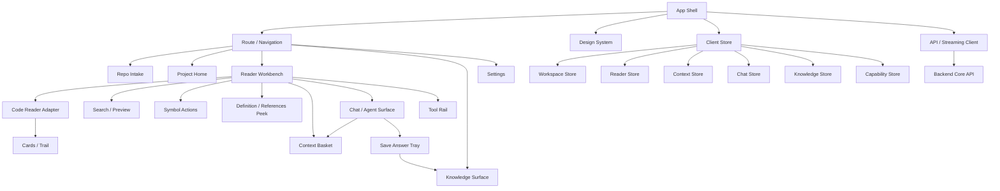
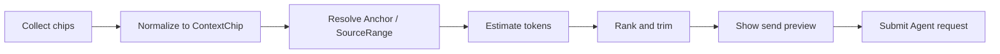
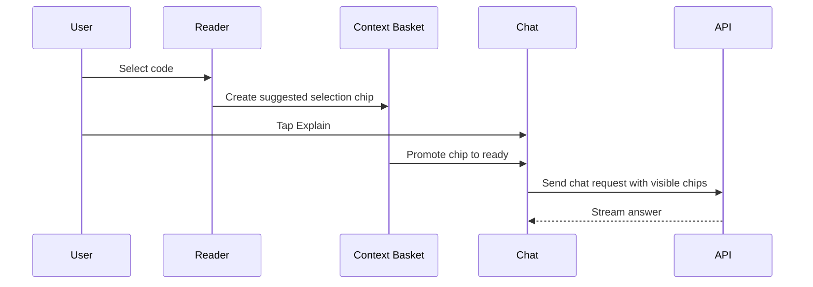
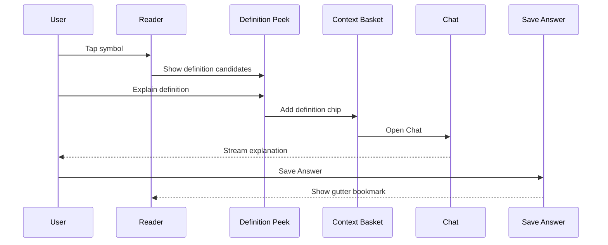
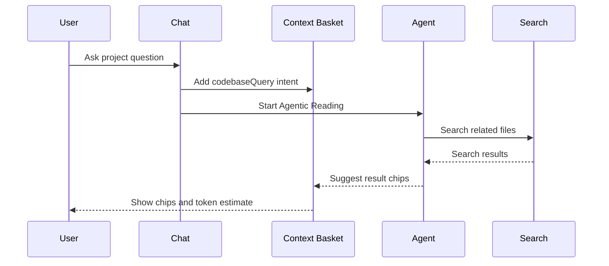

# Pocket Vibe Web/PWA 前端模块设计

版本：Frontend Design v0.1  
日期：2026-05-16  
阶段：工程启动前前端设计  
适用范围：Pocket Vibe Web/PWA MVP 前端；后续 Android / HarmonyOS 原生端复用信息架构、状态模型和核心交互语义。

## 1. 设计目标

本文档专门定义 Web/PWA 前端模块，不覆盖后端 core service、Android 原生实现和完整 Agent runtime 选型。

前端 MVP 的目标不是做一个桌面 IDE，也不是把所有能力堆进 Chat，而是在移动优先的代码阅读场景里跑通：

```text
Open repo -> Read code -> Add context -> Ask / Agentic Reading -> Save Answer -> Jump back
```

前端设计要解决：

1. Reader、Search、Definition、Chat、Context Basket、Knowledge Surface 如何协作。
2. 哪些状态属于前端 UI，哪些必须映射到平台无关 DTO。
3. 移动端小屏下如何表达项目上下文，不让用户困惑“AI 到底看到了什么”。
4. 如何参考 VS Code Copilot Chat / `vscode-copilot-chat` 的上下文设计，但不照搬桌面 IDE 交互。
5. 如何为后续 Agent product benchmark、Android 原生端和多端 Agent runtime 留出边界。

## 2. 参考对象

### 2.1 重点参考：VS Code Copilot Chat

`microsoft/vscode-copilot-chat` 是 Copilot Chat for VS Code 的开源仓库，应作为 Pocket Vibe 前端 Chat / Context / Agent UI 的重点参考对象。

需要参考的不是它的具体 VS Code extension API，而是这些产品和架构思想：

- Chat 不是孤立输入框，而是依赖 IDE 当前活动、选择区、文件、代码库和工具系统。
- 上下文有显式和隐式两类：用户明确添加的 context，以及系统根据当前活动建议或自动附带的 context。
- `#` mention / Add Context / context picker 是可学习的上下文入口。
- `#file`、`#selection`、`#codebase`、`#git` 这类变量让上下文变得可见、可组合。
- Chat participants、slash commands、Agent Mode 等机制把不同任务类型分流，而不是所有任务都塞进一个输入框。
- Agent / Ask / Edit 的能力边界不同，权限和 UI 也不同。

Pocket Vibe 要借鉴这些模式，但必须转译成移动源码阅读器：

- 不默认开放编辑源码。
- 不默认执行 terminal。
- 以 Reader、Preview、Anchor、SavedAnswer、Annotation、NoteDocument 为中心，而不是以 IDE 编辑器为中心。
- 在发送前明确展示“将发送哪些上下文”。

### 2.2 其他产品级参考

前端设计还应在后续 benchmark 中参考：

- Cursor：AI-first IDE、codebase indexing、rules、Plan / Agent、checkpoint、跨端 agent。
- Claude Code：terminal-first agent、权限模型、MCP、计划/执行、subagents。
- OpenAI Codex / Codex CLI / Codex App：sandbox、worktree、parallel agent、background tasks。
- GitHub Copilot Chat / VS Code Agent Mode：Ask / Edit / Agent 模式分层、chat variables、participants。
- opencode：client-server architecture、provider-agnostic、local/self-host、terminal / desktop / IDE surfaces。

本文档只落前端模块设计，不做完整竞品拆解。

## 3. 前端设计原则

### 3.1 Reader first

代码阅读区是主界面。Search、Chat、Context Basket、Save Answer、Annotation 和 NoteDocument 都围绕 Reader 工作，不应把 Reader 降级成背景。

### 3.2 Context visible

用户必须能看见当前问题会带哪些上下文。Pocket Vibe 不能让 AI 静默读取一堆用户不知道的文件。

### 3.3 Preview before jump

Search、Definition、References 都先 preview。只有 `Open` / `Jump` 才改变主 Reader 位置和阅读轨迹。

### 3.4 Mobile-friendly, not IDE-copy

可以学习 VS Code Copilot Chat 的上下文模型，但不能照搬桌面 sidebar、command palette 和多面板密度。移动端需要底部 sheet、紧凑 chip、分步展开和清晰的主操作。

### 3.5 Product state over UI state

前端状态要尽量转换为平台无关模型：`SourceRange`、`Anchor`、`SourceReference`、`ContextChip`、`ChatSession`、`SavedAnswer`、`Annotation`、`NoteDocument`、`ToolCallLog`。不能把 CodeMirror state、DOM range、scroll pixel 当成长期状态。

### 3.6 Permissioned Agent UI

Safe read / Analysis 可以自动执行；App write 需要确认；Source write 和 Dangerous action 在 MVP 禁止。前端必须把权限状态展示出来，而不是只让后端拦截。

## 4. 前端总体架构



## 5. 建议目录结构

这是前端模块边界建议，不代表现在要立刻创建代码。

```text
apps/web/src/
  app/
    routes/
    shell/
    providers/
  modules/
    repo/
    project/
    workbench/
    code-reader/
      cards-trail/
    search/
    symbol-actions/
    context-basket/
    chat/
    knowledge/
    settings/
  shared/
    api/
    schema/
    store/
    ui/
    accessibility/
    platform/
    telemetry/
    testing/
```

设计约束：

- `modules/*` 之间通过 shared store / events / DTO 通信，避免直接互相拿内部组件状态。
- `shared/schema` 只放平台无关类型，不引用 React、CodeMirror、DOM。
- `code-reader` 可以适配 CodeMirror，但不能让 CodeMirror 类型泄漏到 `context-basket`、`knowledge`、`chat`。

## 6. 模块设计

### 6.1 App Shell

职责：

- 路由和页面壳。
- PWA manifest、service worker、离线状态。
- 全局错误边界。
- 全局快捷入口：回到项目、打开最近文件、打开设置。
- 注入 API client、store、theme、a11y provider。

不负责：

- 解析仓库。
- 管理 CodeMirror state。
- 拼接 Agent prompt。

### 6.2 Repo Intake

职责：

- 空状态。
- GitHub URL 输入。
- URL 基础校验。
- clone task 进度。
- clone 成功后进入 Project Home 或 Reader。

关键状态：

- idle。
- validating。
- cloning。
- failed。
- succeeded。

移动端规则：

- 输入框和主按钮在首屏可见。
- 错误文案直接说明是否“不支持私有仓库 / 非 GitHub / 网络失败”。
- clone 失败时允许 retry / remove task。

### 6.3 Project Home

职责：

- 项目列表。
- 最近打开文件。
- 最近阅读轨迹。
- 笔记入口。
- 继续阅读入口。

MVP 可简化：

- 有 repo 时默认进入最近文件。
- 首次打开 repo 时进入 file tree 或推荐入口文件。

### 6.4 Reader Workbench

职责：

- 组合代码阅读、搜索、符号动作、Chat、Context Basket、Cards、Trail。
- 管理当前项目、文件、选区、当前 symbol、活动面板。
- 处理横竖屏布局。

Workbench 的核心规则：

- Search / Definition / References 默认是 peek，不改变主 Reader。
- Chat 打开后仍保留当前代码上下文摘要。
- Save Answer 和 Annotate 不离开 Reader。
- 横竖屏切换后保留当前文件、滚动位置、选区、context chips、chat draft。

概念状态：

```ts
type ReaderWorkbenchViewState = {
  currentProjectId: string;
  currentFilePath?: string;
  currentSelection?: SourceRange;
  currentSymbol?: SymbolRef;
  activePanel: "none" | "search" | "definition" | "references" | "chat" | "cards" | "trail";
  chatMode: "closed" | "half" | "full";
  orientation: "portrait" | "landscape";
};
```

### 6.5 Code Reader Adapter

职责：

- 使用 CodeMirror 6 展示只读代码。
- 展示行号、语法高亮、折叠、选区、sticky symbol、gutter bookmark。
- 把 UI selection 转成 `SourceRange`。
- 把 token 点击转成 `SymbolActionRequest`。

输入：

- `ReaderPayload`。
- 当前 fold state。
- 当前 anchor / saved-answer / annotation bookmarks。
- capability status。

输出：

- selection changed。
- token activated。
- scroll position changed。
- fold state changed。
- anchor visible / invisible。

边界：

- 不保存业务状态。
- 不直接调用 Agent。
- 不把 CodeMirror object 暴露给 Chat、Knowledge、Context Basket。

### 6.6 Search / Preview

职责：

- 搜索输入。
- 搜索结果列表。
- 点击结果后展示 preview。
- 支持 Explain / Open / Back。

借鉴点：

- 类似 Copilot Chat 中显式添加 `#file`、`#selection`，SearchResult 也应能一键加入上下文。

行为：

- `Explain`：把 search result 转成 `ContextChip`，打开 Chat。
- `Open`：改变主 Reader，写入 reading trail。
- `Back`：回到结果列表，保留 query。

### 6.7 Symbol Actions

职责：

- token 点击 / 长按后的动作菜单。
- `Go to definition`。
- `Find references`。
- `Explain symbol`。
- `Add symbol to context`。

降级：

- indexing：禁用精准定义，提供 candidate search。
- failed：展示失败原因和 retry。
- unsupported：允许 explain/search，不承诺精准导航。

### 6.8 Definition / References Peek

职责：

- 展示 definition candidates。
- 展示 references candidates。
- 提供 confidence、source、snippet。
- 支持 Explain / Open / Add to context。

移动端规则：

- Definition 用紧凑底部 peek。
- References 数量多时进入半屏列表。
- 横屏时右侧面板展示。

### 6.9 Context Basket

Context Basket 是 Pocket Vibe 前端最关键的模块之一。它回答用户最关心的问题：

```text
AI 这次到底会看哪些代码和材料？
```

#### 6.9.1 参考 VS Code Copilot Chat

VS Code Copilot Chat 的关键启发：

- 隐式上下文：当前选择、当前文件、活动编辑器等可以作为建议上下文。
- 显式上下文：通过 `#` mention 或 Add Context 选择文件、文件夹、符号、工具、终端输出、source control changes。
- chat variables：`#file`、`#selection`、`#codebase`、`#git` 等让上下文有可见名称。
- chat participants：`@workspace`、`@terminal`、`@vscode`、`@github` 等把能力域分开。
- slash commands：把常用任务变成显式意图。

Pocket Vibe 的转译：

- `#selection` -> 当前选区 chip。
- `#file` -> 当前文件 chip。
- `#symbol` -> 当前函数 / 类 / 方法 chip。
- `#definition` -> Definition Peek 结果 chip。
- `#references` -> References 结果集合 chip。
- `#search` -> Search Preview / selected results chip。
- `#trail` -> 最近阅读轨迹 chip。
- `#saved-answer` -> 已保存 AI 回答 chip。
- `#annotation` -> 代码旁批 chip。
- `#study-note` -> 整理型学习笔记 chip。
- `#map-node` -> Code Map 节点 chip。
- `#codebase` -> 项目级检索模式，不直接塞整仓库。

#### 6.9.2 Basket 类型

| 类型 | 来源 | 用途 |
|---|---|---|
| `selection` | Reader selection | 解释选中代码、保存回答或添加批注 |
| `file` | 当前文件 / file tree | 解释文件职责、总结文件 |
| `symbol` | sticky symbol / token action | 解释函数、追调用链 |
| `definition` | Definition Peek | 解释定义、比较候选 |
| `references` | References Panel | 分析调用方式 |
| `searchResult` | Search Preview | 解释命中片段 |
| `trail` | Reading Trail | 让 Agent 知道用户刚读过什么 |
| `savedAnswer` | Knowledge Surface | 基于已保存 AI 回答继续提问 |
| `annotation` | Knowledge Surface / gutter bookmark | 基于源码旁批继续提问 |
| `noteDocument` | Knowledge Surface | 基于整理型学习笔记继续提问 |
| `dailyReport` | Daily Report | P1 回顾今日阅读 |
| `mapNode` | Code Map | 从模块视角提问 |
| `codebaseQuery` | 项目检索 | 让 Agent 先查再答 |

#### 6.9.3 Basket 状态

```ts
type ContextChipStatus =
  | "suggested"
  | "ready"
  | "pinned"
  | "stale"
  | "missing"
  | "oversized"
  | "trimmed";
```

状态说明：

- `suggested`：系统建议，尚未确认。
- `ready`：会进入本次请求。
- `pinned`：用户明确固定，trim 时优先保留。
- `stale`：Anchor 可能失效，发送前提示。
- `missing`：来源文件或位置找不到。
- `oversized`：超过预算，需要裁剪。
- `trimmed`：已经被系统裁剪。

#### 6.9.4 Basket UI

Chat 视图中（顶部折叠）：

```text
[Context Basket]
[Current function resolveModule] [definition: resolver.ts:132] [+ Add]
[Token estimate 3.2k / 16k]
```

上下文预览中（完整展示）：

点击 chip 后展开：

- 类型。
- 文件路径。
- 行号范围。
- token estimate。
- stale / confidence 状态。
- actions：Jump、Preview、Pin、Remove、Replace、Relink。

Add Context 入口：

- Current selection。
- Current function。
- Current file。
- Search result。
- Definition result。
- Recent trail。
- SavedAnswer / Annotation / NoteDocument。
- Project search。

移动端限制：

- 默认只显示前 2-3 个 chip，其余折叠为 `+3`。
- 发送前如上下文较大，必须进入 review sheet。
- 不使用桌面式长列表作为唯一入口。

#### 6.9.5 Basket Resolver Pipeline



步骤：

1. collect：从 Reader、Search、Definition、Knowledge、Trail 收集 context candidates。
2. normalize：统一成 `ContextChip`。
3. resolve：把 chip 解析成最新 `SourceRange` / `Anchor`。
4. estimate：估算 token 和成本。
5. rank：按用户 pin、当前选区、当前 symbol、recent trail、search confidence 排序。
6. trim：超过 budget 时优先裁剪低优先级 chip。
7. preview：发送前展示最终上下文。

#### 6.9.6 隐式上下文策略

参考 VS Code Copilot Chat，但 Pocket Vibe 必须更保守：

| 场景 | 隐式上下文 | 是否自动发送 |
|---|---|---|
| Ask current selection | selection、file path、symbol name | 是，但要显示 chip |
| Explain definition | selected definition candidate | 是，但要显示 chip |
| Ask current file | current file | 用户确认后发送 |
| Project question | codebase query intent | 不发送整仓库，只触发检索 |
| Agentic Reading | current file、symbol、trail suggestions | Agent 可建议，用户可裁剪 |

原则：

- 隐式不等于不可见。
- 自动添加的 context 也要在 chip 区显示。
- 大上下文必须发送前确认。

#### 6.9.7 Context Participants

Pocket Vibe 可借鉴 `@workspace` / `@terminal` / `@vscode` 的思想，但参与者应服务读码场景：

| Participant | 职责 | MVP |
|---|---|---|
| `@reader` | 当前文件、选区、symbol、fold、trail | P0 |
| `@codebase` | 项目搜索、相关文件、调用链候选 | P0/P1 |
| `@knowledge` | SavedAnswer、Annotation、NoteDocument、已保存理解 | P0 |
| `@agent` | 多步读码任务、计划和总结 | P0/P1 |
| `@settings` | 模型、token、隐私、同步设置 | P1 |

移动端可以不直接暴露 `@` 语法，但内部模型要支持 participant 分流。

#### 6.9.8 Slash Commands / Quick Actions

快捷动作应映射到结构化 intent：

| UI 动作 | Intent |
|---|---|
| Explain | `explain_current_context` |
| Next file | `suggest_next_files` |
| Call chain | `trace_call_chain` |
| Summarize file | `summarize_file` |
| Save Answer | `save_answer` |
| Create Study Note | `create_study_note_draft` |
| Daily report | `create_daily_report_draft` |
| Find candidates | `recover_stale_anchor` |

这些动作不只是 prompt 模板，而是明确声明可用工具、默认上下文和权限等级。

### 6.10 Chat / Agent Surface

职责：

- 全屏 Chat 视图。
- 展示 Context Basket。
- 展示快捷动作。
- 展示 Agent plan / tool calls / streaming response。
- 保存回答为 SavedAnswer。
- 支持 cancel / retry / continue。

视图切换：

| 视图 | 展示内容 | 触发 |
|---|---|---|
| Chat 视图（默认） | Context Basket + Chat Messages + 输入框 | 打开 Chat |
| 上下文预览 | Reader + Context Basket，隐藏 Chat 消息和输入框 | 点击"预览上下文" |

- Chat 视图全屏展示消息区域，Context Basket 固定在顶部可折叠。
- 上下文预览用于对照代码确认当前累积的上下文，不触发发送。
- 预览中可添加/删除 chips，确认后切回 Chat 视图。

模式：

| 模式 | 用途 |
|---|---|
| Ask | 单轮或短上下文问答 |
| Plan | 生成阅读计划，不立即执行多步工具 |
| Agentic Reading | 多步读码调查，工具调用可见 |
| Study Note Draft | 整理为 Markdown 草稿 |

Agent 运行态：

- idle。
- planning。
- running。
- waiting for confirmation。
- streaming。
- completed。
- failed。
- cancelled。

ToolCall 展示：

- 默认折叠。
- 显示工具名、目标、状态。
- 可展开查看摘要和引用。
- 失败时可 retry 或跳过。

### 6.11 Save Answer / Annotation / Study Note

职责：

- `Save Answer`：保存 AI response、Context Basket chip 和 source reference。
- `Annotate`：保存当前行、函数或选区上的短批注。
- `Create Study Note` / `Add to Study Note`：创建或追加整理型 Markdown 文档。
- 标题编辑。
- Source chips。
- Markdown preview。
- Later / Save Answer / Save Annotation。

规则：

- 没有可保存内容时不显示保存入口。
- 保存后不离开 Reader。
- snackbar 提供 View / Undo。
- gutter bookmark 更新。

### 6.12 Knowledge Surface

职责：

- SavedAnswer list/detail。
- Annotation list/detail。
- NoteDocument list/detail。
- Source chip 回跳。
- stale anchor 候选。
- Daily Report 作为 P1。

SavedAnswer、Annotation、NoteDocument 可以作为 Context Basket 来源。

### 6.13 Cards / Trail

职责：

- 最近打开文件卡片。
- 阅读轨迹 back / forward。
- 当前 session 的读码路径。
- 支持将 trail 加入 context。

### 6.14 Tool Rail

职责：

- 显性入口，不依赖隐形边缘手势。
- Search。
- Cards。
- Trail。
- Knowledge。
- Context。

按钮至少 44px，有可访问名称。

### 6.15 Settings

职责：

- 模型 profile。
- base URL。
- API key 状态。
- token budget。
- 主题 / 字号 / 软换行。
- 隐私和同步说明。

P0 可只做最小模型配置入口。

### 6.16 Client Store

Store 切片：

| Store | 内容 |
|---|---|
| `workspaceStore` | workspace、project list、clone task |
| `readerStore` | current file、selection、symbol、scroll restoration、panel |
| `contextStore` | context chips、suggested chips、token estimate |
| `chatStore` | session、messages、agent run、tool calls、draft |
| `knowledgeStore` | SavedAnswer、Annotation、NoteDocument draft、save status、bookmarks |
| `trailStore` | reading trail、file cards |
| `capabilityStore` | indexing、semantic、offline、model provider |
| `settingsStore` | theme、font size、wrap、model profile |

持久化规则：

- UI 展开高度不入后端。
- `SourceRange` / `Anchor` 入后端或本地持久化。
- chat draft 和 NoteDocument draft 可本地缓存。

### 6.17 API / Streaming Client

职责：

- 类型化 API 请求。
- 错误码映射。
- streaming response。
- cancel / retry。
- request id / trace id。
- ToolCallLog event stream。

前端不直接调用模型 provider。

## 7. 核心交互流

### 7.1 Selection -> Ask



### 7.2 Definition -> Explain -> Save



### 7.3 Project Question -> Codebase Search



## 8. Responsive Layout

### 8.1 Chat View（默认）

- 全屏展示 Chat Messages 和输入框。
- Context Basket 固定在顶部，默认折叠为 chips，可展开。
- 用户点击"预览上下文"切换到上下文预览视图。

### 8.2 Context Preview

- Reader 展示当前代码。
- Context Basket 展示全部 chips，可添加/删除。
- 不显示 Chat 消息和输入框。
- 确认后切回 Chat 视图。

### 8.3 Landscape

- 左 58% Reader。
- 右 42% 活动面板：Chat / Search / Definition / References。
- 上下文预览时右侧展示 Context Basket。
- 键盘态必须保持 Send / Save 可见。

### 8.4 Small Screens

Must verify:

- 360x780。
- 390x844。
- 430x932。

Rules:

- Buttons do not truncate important labels.
- Context chips can wrap or collapse.
- Send / Save / Later remain reachable.

## 9. Accessibility

Requirements:

- Buttons have accessible names.
- Context chip status not only color-coded.
- Search result and definition candidate are keyboard/focus accessible where applicable.
- Chat streaming updates should not trap focus.
- Touch targets >= 44px.
- Sheet has close / back action.

## 10. Frontend Testing Strategy

### 10.1 Unit / Component

- Context chip creation and state transitions.
- Basket resolver ranking / trimming.
- Token estimate display states.
- Store reducers / actions.
- API error mapping.

### 10.2 Integration

- Selection -> Context -> Chat。
- Search -> Preview -> Explain / Open。
- Definition -> Explain -> Save Answer。
- Stale anchor -> candidates。
- Offline -> Chat send disabled。

### 10.3 Visual / Browser

Use Playwright for:

- 360x780。
- 390x844。
- 430x932。
- landscape 844x390。
- keyboard-like viewport shrink。

Screenshots should verify:

- Reader visible area。
- Context Basket not overlapping input。
- Send / Save Answer reachable。
- Long chips do not break layout。

## 11. 前端 MVP 切片

### FE Slice 0：前端设计冻结

- 本文档。
- Context Basket state machine。
- Frontend module map。
- VS Code Copilot Chat reference notes。

### FE Slice 1：Mock App Shell

- App shell。
- Mock repo。
- Mock reader payload。
- Mock context chips。
- Mock chat streaming。

验收：

- 不接真实后端也能演示 `Read -> Add Context -> Ask -> Save Answer`。

### FE Slice 2：Reader Workbench

- CodeMirror 6 read-only adapter。
- Selection -> `SourceRange`。
- Sticky symbol mock。
- Gutter bookmark mock。

### FE Slice 3：Search / Definition / Preview

- Search sheet。
- Preview sheet。
- Definition Peek。
- Add result to Context Basket。

### FE Slice 4：Context Basket

- Explicit chips。
- Suggested chips。
- Add Context picker。
- token estimate。
- trim / remove / pin。
- send preview。

### FE Slice 5：Chat / Agent Surface

- Ask / Plan / Agentic Reading modes。
- ToolCallLog display。
- streaming / cancel / retry。
- Save Answer Tray。

### FE Slice 6：Knowledge / Trail

- SavedAnswer / Annotation / NoteDocument list/detail。
- Source chip jump。
- stale anchor UI。
- Reading trail；Daily Report draft 作为 P1。

## 12. 不做事项

前端 MVP 不做：

- 源码编辑器。
- 直接修改源码。
- Terminal。
- Git commit / branch / PR。
- VS Code extension API 适配。
- 直接复刻 VS Code Copilot Chat UI。
- 隐式发送大上下文。
- 在浏览器中运行完整 LSP。

## 13. 工程启动前检查清单

1. Context Basket 是否能清楚表达 AI 将看到什么。
2. 隐式上下文是否都可见。
3. `#codebase` 是否被设计为检索 intent，而不是整仓库塞 prompt。
4. CodeMirror 类型是否不会泄漏到 schema / context / knowledge。
5. Chat 是否区分 Ask、Plan、Agentic Reading。
6. App write 是否需要用户确认。
7. Save Answer / Annotate 是否不打断 Reader。
8. 横竖屏和小屏键盘态是否有明确布局。
9. VS Code Copilot Chat 的上下文模型是否已经被转译，而不是照搬。
10. Android native renderer 是否能复用 Reader payload 和 ContextChip。

## 14. 待决问题

1. 前端框架选择：React、Vue、Svelte 或其他。
2. Store 方案：Zustand、Redux Toolkit、TanStack Store 或框架内置状态。
3. Context Basket token estimate 在前端估算还是完全依赖后端。
4. `#` mention 是否在移动端直接暴露，还是只作为内部模型。
5. 是否需要桌面 Web 的 keyboard shortcut。
6. Context chip 是否支持用户自定义命名。
7. Code Map 节点如何进入 Context Basket。
8. NoteDocument / DailyReport 是否支持前端离线编辑。

## 15. 参考资料

- VS Code Copilot Chat 开源仓库：https://github.com/microsoft/vscode-copilot-chat
- VS Code Manage context for AI：https://code.visualstudio.com/docs/copilot/copilot-chat-context
- GitHub Copilot Chat prompt docs：https://docs.github.com/en/copilot/using-github-copilot/copilot-chat/getting-started-with-prompts-for-copilot-chat
- GitHub Copilot Chat cheat sheet：https://docs.github.com/en/copilot/reference/cheat-sheet?tool=vscode
- GitHub Copilot in VS Code features：https://code.visualstudio.com/docs/copilot/copilot-vscode-features
