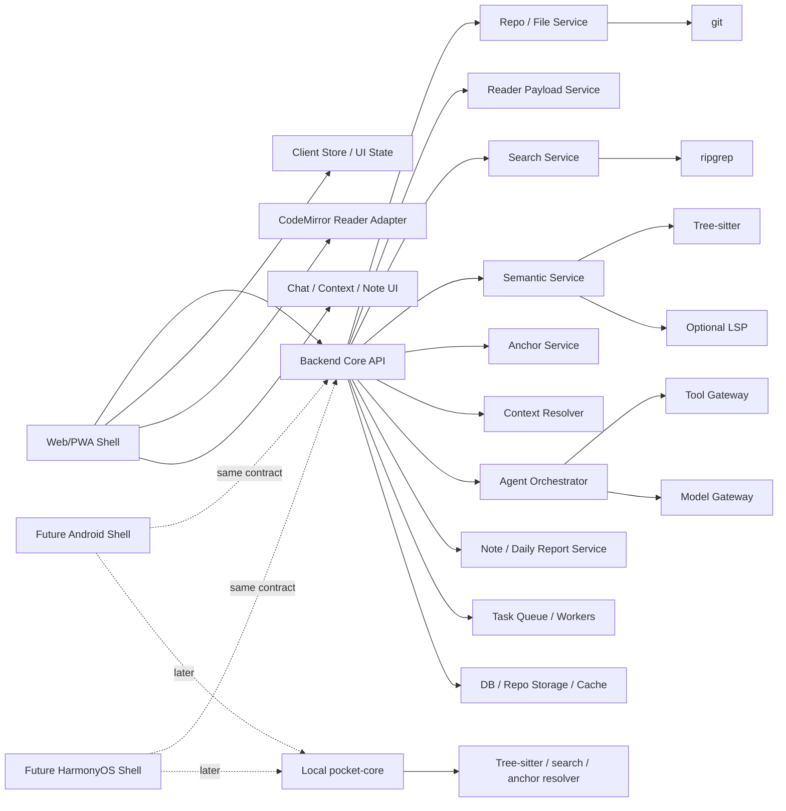
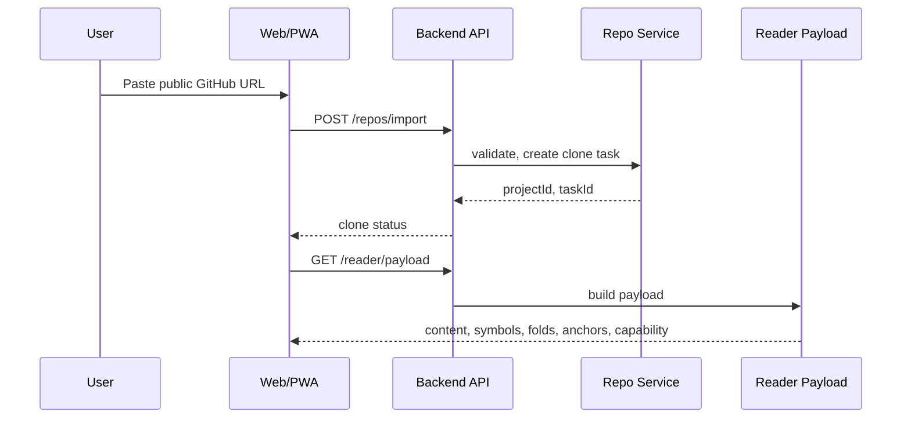
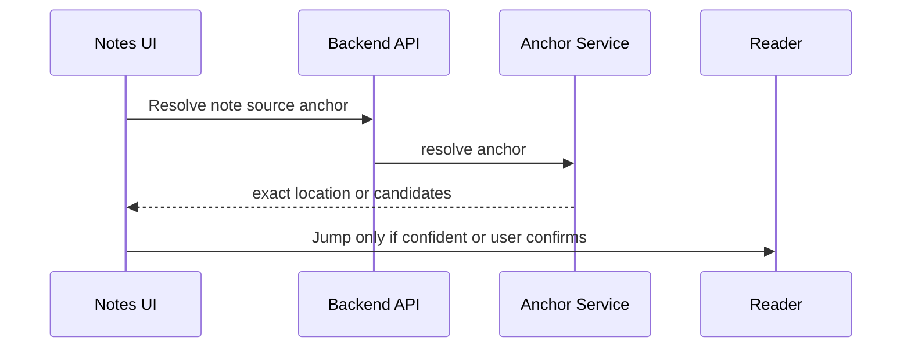

# Pocket Vibe Web/PWA 高层设计

版本：Design v0.2  
日期：2026-05-17  
阶段：工程启动前高层设计  
适用范围：Web/PWA MVP；后续 Android / HarmonyOS NEXT 原生化复用同一 API contract、schema、Anchor、ContextChip、ToolCall 和 ChatSession 协议。

## 1. 文档定位

本文档只保留高层架构、关键设计判断、跨端边界和 MVP 切片。前端、后端的模块细节已经拆到独立文档，避免三份文档互相复制。

| 文档 | 职责 | 不负责 |
|---|---|---|
| 本文档 | 产品技术路线、系统分层、跨端复用边界、MVP 阶段策略、红线和待决问题 | 前端组件细节、后端 API 细节、数据库字段细节 |
| [Web/PWA 前端模块设计](./POCKET_VIBE_WEB_PWA_FRONTEND_MODULE_DESIGN.md) | App Shell、Reader Workbench、Code Reader、Search、Chat / Agent Surface、Context Basket、Notes、响应式布局、前端测试 | 后端服务实现、任务队列、模型网关 |
| [Web/PWA 后端模块设计](./POCKET_VIBE_WEB_PWA_BACKEND_MODULE_DESIGN.md) | Core API、Workspace、Repo、File、Reader Payload、Index、Search、Semantic、Anchor、Context Resolver、Agent、Model Gateway、Note、Task Queue、Persistence | 前端 UI 组件、移动端交互细节 |
| [移动端核心交互 UX 方案](./POCKET_VIBE_MOBILE_UX_SPEC.md) | 移动端关键体验、Reader first、Preview before jump、Chat / Save Note 行为验收 | 工程模块拆分 |
| [技术可行性与架构报告](./POCKET_VIBE_TECH_FEASIBILITY_ARCHITECTURE_REPORT.md) | 技术路线论证、Web/PWA vs Android/HarmonyOS、长期风险和参考资料 | 当前工程切片的模块设计 |

## 2. 设计目标

Pocket Vibe 第一阶段采用 **Web/PWA 优先验证**。目标不是一次性做完整移动 IDE，而是最快验证：

```text
Open public repo -> Read code -> Add context -> Ask / Agentic Reading -> Save note -> Jump back
```

本阶段要钉住五件事：

1. Web/PWA shell、后端 core service、未来 Android/HarmonyOS shell 的边界。
2. Reader、Search、Definition、Chat、Note、Anchor 的共享协议。
3. `ContextChip`、`ToolCall`、`Anchor`、`Note`、`ChatSession` 等平台无关 schema。
4. Agent 能力的产品预期和开源生态复用策略。
5. 后续原生端只替换 shell / renderer / storage adapter / local core，不重做业务协议。

## 3. 高层原则

### 3.1 Reader first

Reader 是主场景。Search、Definition、Chat、Context Basket、Note 都服务于代码阅读，不应把 Reader 降级成背景面板。

### 3.2 Preview before jump

Search、Definition、References 默认先 preview。只有用户明确 `Open` / `Jump`，才改变主 Reader 位置并写入 reading trail。

### 3.3 Context visible

用户必须知道 AI 本次会看到哪些上下文。隐式上下文也要以 chip 或 review sheet 的形式可见。

### 3.4 Core service owns code intelligence

git、Tree-sitter、ripgrep、LSP / semantic-lite、Anchor resolver、Context resolver、Agent tool gateway 都属于后端 core service 或未来 local core。前端和原生端只消费结构化 DTO。

### 3.5 Product state over UI state

长期数据不能绑定 CodeMirror state、DOM range、scroll pixel、Android View 坐标。代码位置必须表达为 `SourceRange` / `Anchor`。

### 3.6 Agent is permissioned and ecosystem-first

Agent 不应弱化成聊天框，也不能闭门造弱版 runtime。它要支持多步读码调查、上下文组织、笔记草稿和日报草稿；同时必须分级授权：Safe read / Analysis 可自动执行，App write 需确认，Source write 和 Dangerous action 在 MVP 禁止。

正式实现前必须先做产品 benchmark 和开源 PoC，重点参考 Cursor、Claude Code、Codex、Copilot Chat / Agent Mode、opencode，以及 LangGraph、Mastra、OpenHands、Cline、Goose、Aider、Continue、AutoGen 等生态。

### 3.7 China-friendly by default

Web/PWA 和后续 Android 设计都不能硬依赖 Google Cloud、Firebase、GMS、FCM、Google Sign-In、Google Analytics 等能力。国内包和国内部署默认 non-GMS / self-host friendly。

## 4. 总体架构



## 5. 分层边界

| 层 | 当前 Web/PWA 责任 | 后续原生端责任 | 不应承担 |
|---|---|---|---|
| Web/PWA Shell | Reader、Search、Chat、Context Basket、Note、PWA shell cache、前端状态 | 不适用 | git clone、重型索引、LSP runtime、模型 provider 直连 |
| Backend Core API | repo、file、reader payload、search、semantic、anchor、context、agent、note、task、persistence | 首版 Android/HarmonyOS 继续复用 | UI 私有状态、平台 View 坐标 |
| Shared Schema | Project、SourceRange、Anchor、ContextChip、ToolCall、ChatSession、Note、ReaderPayload 等语义 | 全端复用 | 框架私有类型 |
| Future Native Shell | Android / HarmonyOS 原生 UI、原生 Reader、系统安全存储、离线状态恢复 | 替换 Web shell | 重写 Agent 协议和业务模型 |
| Future Local Core | 本地 parse、search、anchor resolver、部分 repo/index 能力 | 在价值明确后下沉 | 从第一天搬完整后端 |

## 6. 模块概览

### 6.1 前端模块概览

前端详细设计见 [Web/PWA 前端模块设计](./POCKET_VIBE_WEB_PWA_FRONTEND_MODULE_DESIGN.md)。

高层模块：

- App Shell
- Repo Intake
- Project Home
- Reader Workbench
- Code Reader Adapter
- Search / Preview
- Symbol Actions
- Definition / References Peek
- Context Basket
- Chat / Agent Surface
- Save Note Tray
- Notes Surface
- Cards / Trail
- Settings
- Client Store
- API / Streaming Client

其中 Context Basket 是前端核心模块之一，应参考 VS Code Copilot Chat / `vscode-copilot-chat` 的显式上下文、`#file`、`#selection`、`#codebase`、participants 和 slash commands，但转译为移动读码场景。

### 6.2 后端模块概览

后端详细设计见 [Web/PWA 后端模块设计](./POCKET_VIBE_WEB_PWA_BACKEND_MODULE_DESIGN.md)。

高层模块：

- Backend Core API
- Workspace Service
- Repo Service
- File Service
- Reader Payload Service
- Index Service
- Search Service
- Semantic Service
- Anchor Service
- Context Resolver Service
- Agent Orchestrator
- Tool Gateway
- Model Gateway
- Note Service
- Daily Report Service
- Capability Service
- Task Service / Queue
- Persistence / Storage
- Observability
- Security / Privacy

## 7. 共享协议与核心模型

本节只列协议边界，字段定义以 shared schema review 和前后端模块文档为准。

| 模型 | 用途 | 权威设计位置 |
|---|---|---|
| `Project` / `Workspace` | repo 和工作区元数据 | 后端模块设计 |
| `SourceRange` | 平台无关代码范围 | 高层 + shared schema |
| `Anchor` | 可恢复代码位置、Note source、stale recovery | 后端模块设计 |
| `ReaderPayload` | Web CodeMirror 和未来原生 Reader 共同消费 | 前端/后端模块设计 |
| `ContextChip` | 用户可见上下文篮子 | 前端模块设计 |
| `ResolvedContext` | 发送给 Agent 前的解析结果 | 后端模块设计 |
| `ToolCall` / `ToolCallLog` | Agent 工具调用和审计 | 后端模块设计 |
| `ChatSession` / `AgentRun` | Chat 和多步读码任务 | 后端模块设计 |
| `Note` / `DailyReport` | 知识沉淀 | 后端模块设计 |
| `CapabilityStatus` | indexing、semantic、model、offline 等能力状态 | 高层 + 后端模块设计 |

硬性要求：

- schema 不引用 React、CodeMirror、DOM、Android View、Compose、ArkUI 类型。
- `#codebase` 是 retrieve intent，不是整仓库 prompt。
- ToolCallLog 由后端作为权威来源。
- API key 和 provider secret 不进入普通日志、同步载荷或 ToolCallLog。

## 8. 核心流程

### 8.1 Import -> Reader



### 8.2 Preview -> Ask -> Save

```mermaid
sequenceDiagram
  participant FE as Reader / Peek
  participant Basket as Context Basket
  participant API as Backend API
  participant Context as Context Resolver
  participant Agent as Agent Orchestrator
  participant Note as Note Service

  FE->>Basket: Add selection / definition / search chip
  Basket->>API: Resolve context
  API->>Context: resolve, estimate, trim
  Context-->>FE: send preview
  FE->>API: Send Ask / Agentic Reading
  API->>Agent: run with tools
  Agent-->>FE: stream answer and ToolCallLog
  FE->>API: Save note
  API->>Note: create note with anchors
```

### 8.3 Note -> Source



## 9. Agent benchmark 和生态策略

Agent 能力分两条线推进：

1. **Product benchmark**：拆解 Cursor、Claude Code、Codex、Copilot Chat / Agent Mode、opencode 等产品级 coding agent，形成能力预期、UX、权限模型和任务流对照。
2. **Ecosystem PoC**：选 2-3 个开源框架或 runtime 做薄 PoC，验证工具权限、ToolCallLog、自定义读码工具、streaming、cancel、self-host 和国内网络可行性。

Pocket Vibe 复用或借鉴：

- Agent runtime / workflow graph。
- tool registry / permission / trace。
- model routing / provider adapter。
- repo map / context compression。
- eval / replay / observability。
- checkpoint / task recovery / human-in-the-loop。

Pocket Vibe 自研或深度定制：

- SourceRange / Anchor / stale recovery。
- Context Basket 的移动端呈现。
- Preview before jump。
- Note / DailyReport / read-pack draft。
- Reader / Chat / Note 状态保持。
- Android non-GMS 和未来原生 Reader 适配。

## 10. Android 后续策略

Android 端不是 WebView 套壳，也不是重做业务逻辑。它应在 Web/PWA 跑通真实闭环后，复用同一套 schema、API、Agent 协议和 Anchor 体系。

Android 核心增量价值：

1. 原生代码阅读手感。
2. 本地已 clone 仓库和后续本机目录导入。
3. 离线阅读、搜索和笔记查看。
4. Android Keystore 保存 API key。
5. WorkManager 后台索引和缓存清理。
6. non-GMS 国内发行环境。

Android 阶段：

| 阶段 | 目标 |
|---|---|
| A0 Contract Readiness | schema 可生成 Kotlin model |
| A1 Backend-connected Shell | Android 壳接入现有后端 |
| A2 Native Reader Spike | Sora/custom View 验证原生 Reader |
| A3 Local State & Secure Key | Room、Keystore、阅读状态恢复 |
| A4 Offline Repo Reading | 本地 repo storage 和文件读取 |
| A5 Local Core Partial | Anchor resolver、Tree-sitter、local search 下沉 |
| A6 Local Semantic Optional | 按语言评估本地 LSP |

Go / No-Go 门槛：

- Web/PWA 真实 `Read -> Ask -> Save` 成立。
- 用户反馈集中在移动端手感、离线、本地仓库、安全存储。
- API contract、schema、Anchor、ContextChip、ToolCall、ChatSession 稳定。
- ReaderPayload 与 CodeMirror 解耦，可被 Kotlin renderer 消费。

## 11. MVP 切片

高层切片只描述跨模块目标。前端/后端更细切片见各自文档。

| Slice | 目标 | 关键交付 |
|---|---|---|
| Slice 0 | 设计冻结 | 高层、前端、后端文档；schema 草案；Agent benchmark 计划 |
| Slice 1 | Mock walking skeleton | Web shell、API skeleton、mock reader/search/chat/note |
| Slice 2 | Repo / File | public GitHub import、clone task、file tree、open file |
| Slice 3 | Reader / Search | ReaderPayload、CodeMirror read-only、ripgrep search、preview |
| Slice 4 | Structure / Semantic-lite / Anchor | symbols、folds、definition/reference candidates、Anchor create/resolve |
| Slice 5 | Context / Agent / Note | Context Resolver、Agent Orchestrator、ToolCallLog、Model Gateway、Save Note |
| Slice 6 | Validation / Polish | daily report、observability、mobile viewport QA、error/degradation QA |

## 12. 首批技术决策建议

| 事项 | 建议 | 原因 |
|---|---|---|
| 首发平台 | Web/PWA | 最快验证产品闭环 |
| 前端 Reader | CodeMirror 6 read-only | 轻量、成熟、适合 Web reader |
| 后端首发 | Go Core Service | 更适合 repo/index/worker/SSE/资源控制，同时用 contract-first 保持前后端一致 |
| 搜索 | 后端 ripgrep | 成熟、快、避免浏览器承担大仓库搜索 |
| 结构解析 | 后端 Tree-sitter | 后续可下沉到 `pocket-core` |
| 语义 | semantic-lite + 按语言 LSP | 避免首发被完整 LSP 矩阵拖住 |
| Chat streaming | SSE 优先 | 简单、易调试，后续可扩展 WebSocket |
| Agent | benchmark + PoC 后决定 | 避免闭门自研弱版 runtime |
| Contract | OpenAPI / JSON Schema | 支撑 TypeScript Web、Go 后端和未来 Kotlin/ArkTS DTO 复用 |
| Android | 后端连接优先，本地 core 后置 | 先复用 Web MVP 验证过的能力 |
| 国内环境 | non-GMS / self-host friendly | 避免基础设施不可用 |

## 13. 明确不做

MVP 不做：

- 私有仓库。
- GitHub OAuth。
- 本地目录导入。
- 浏览器内完整 git clone。
- 浏览器内重型 LSP runtime。
- Agent 直接改源码。
- shell / terminal。
- commit / branch / PR。
- 完整离线读大仓库。
- Android / HarmonyOS NEXT 原生交付。
- Android 本地完整 `pocket-core`。
- GMS / Firebase / FCM 硬依赖。
- Skill marketplace。
- 复杂知识卡片系统。

## 14. 工程启动前检查清单

1. 三份设计文档的职责边界是否清楚。
2. shared schema 是否不含 UI 私有类型。
3. ReaderPayload 是否可被 Web 和未来 Android 共用。
4. Context Basket 是否可见、可裁剪、可解释。
5. `#codebase` 是否是检索 intent，而不是整仓库 prompt。
6. Backend Context Resolver 是否是 Context Basket 的权威解析方。
7. Agent 工具权限是否分级。
8. ToolCallLog 是否可追踪、可脱敏、可回放。
9. Anchor stale 是否不自动低置信跳转。
10. clone / index / agent run 是否任务化。
11. 国内模型和 non-GMS 环境是否不被硬依赖卡住。

## 15. 待决问题

1. 前端框架和 store 方案。
2. Go 后端 router、队列和 DB 访问方案。
3. DB / repo storage 选择。
4. Tree-sitter 集成方式。
5. Agent 首轮 benchmark 和 PoC 候选。
6. 模型 key 策略：用户自带、服务端托管测试 key 或混合。
7. token estimate 在前端、后端还是混合。
8. Android A0 何时启动。
9. 国内包统计、崩溃上报、更新检查和应用市场渠道如何抽象。

## 16. 下一步建议

1. API / DTO review：整理正式 shared schema 草案。
2. Frontend state review：对齐 Reader、Context Basket、Chat、Note 状态。
3. Backend API review：对齐 Go service module、API group、task model、error model。
4. Agent product benchmark：拆解 Cursor、Claude Code、Codex、Copilot Chat / Agent Mode、opencode。
5. Agent ecosystem PoC：选 2-3 个框架验证工具权限、ToolCallLog、自定义读码工具、streaming、cancel 和 self-host。
6. Android contract review：用同一份 schema 试生成 Kotlin data class 草案。
